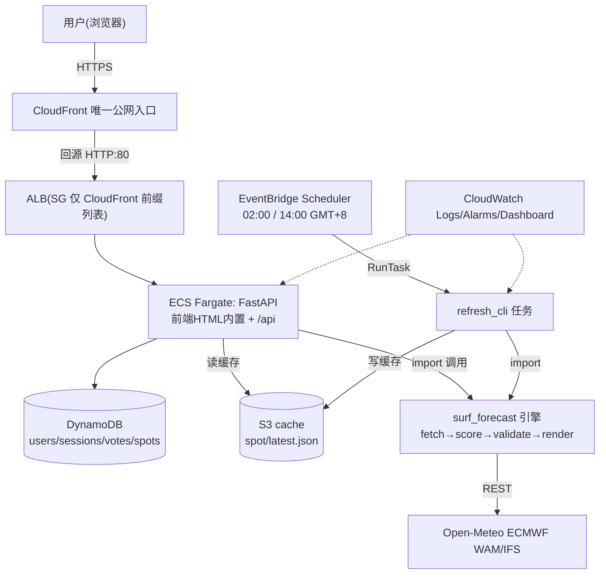
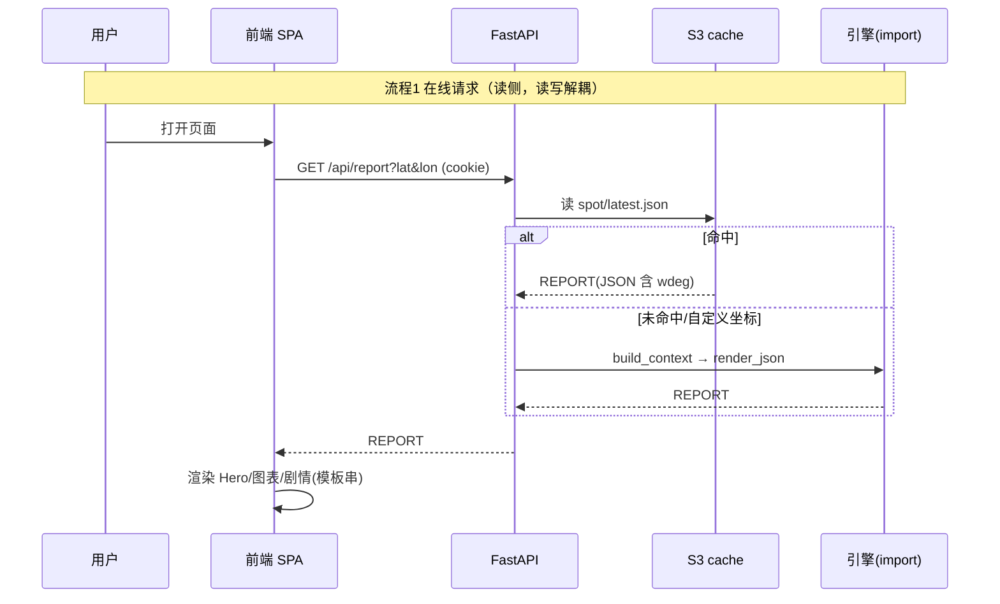
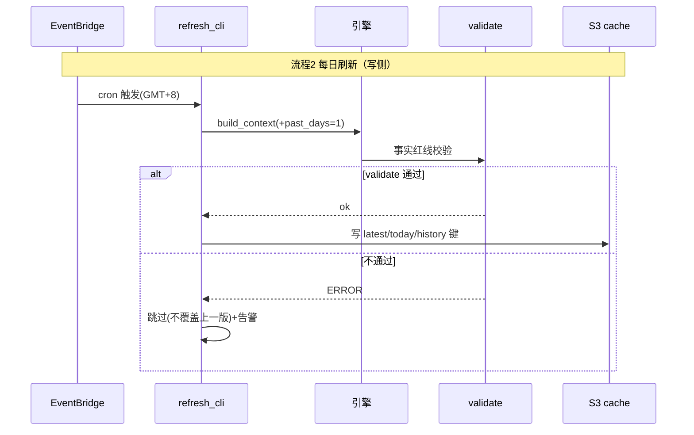
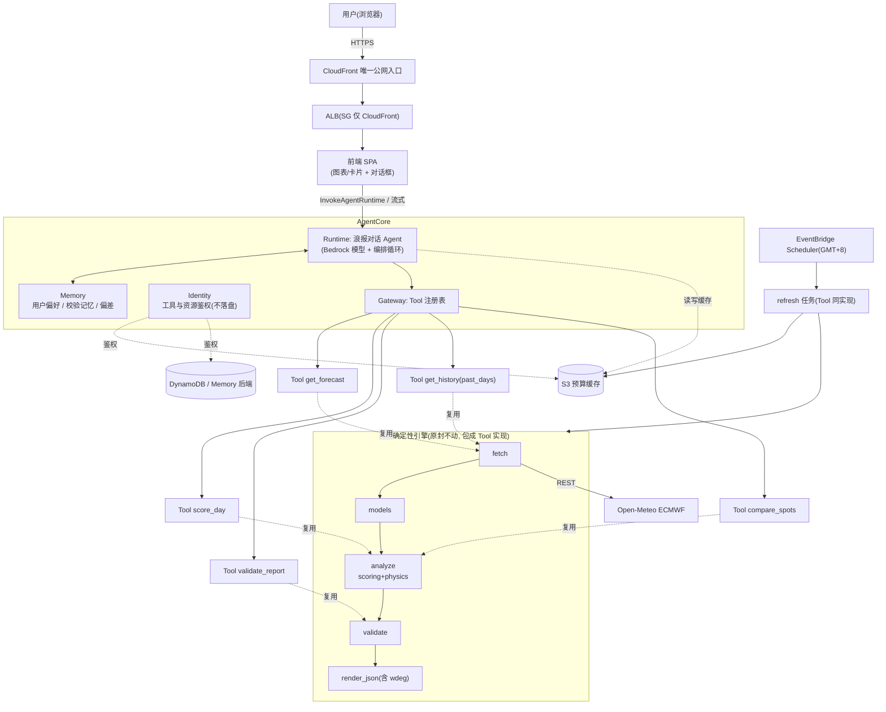
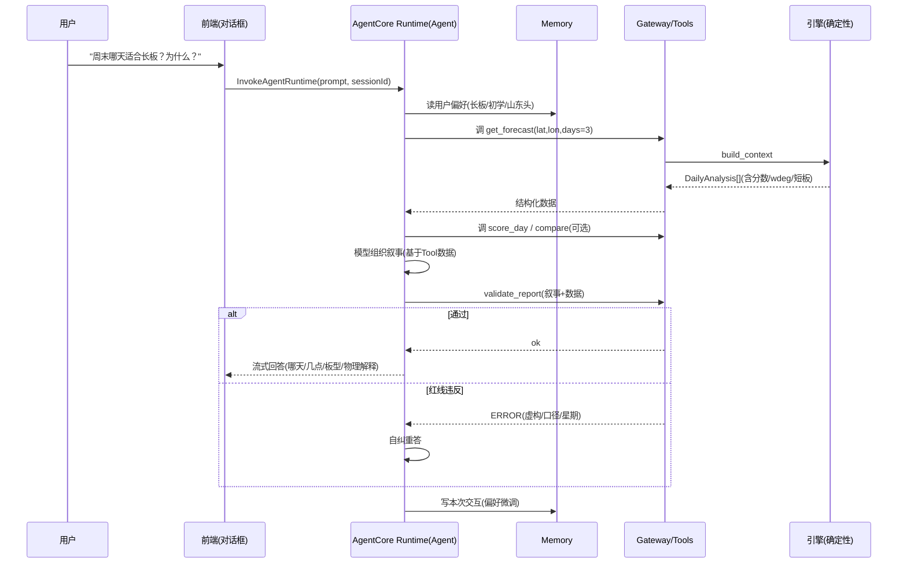
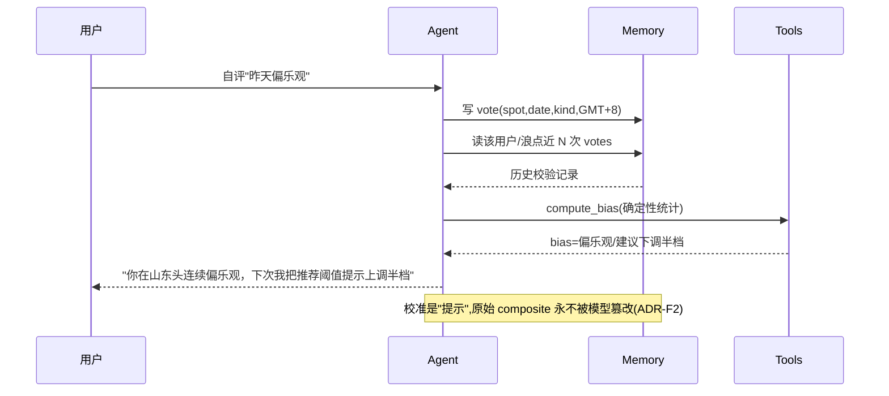
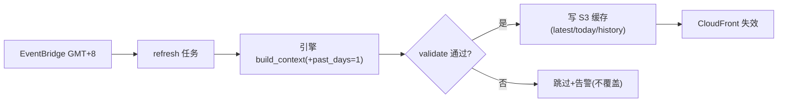
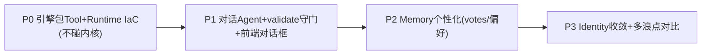

# 浪报 Surf Forecast — 基于 AgentCore 的重构设计文档（供查阅，不改现有代码）

> 版本 v1 ｜ 2026-06-25 ｜ 区域 ap-northeast-1 ｜ account 153705321444
> 性质：**设计探讨文档**，仅供评估。不修改任何 spec 或源码。
> 输入依据：`.kiro/specs/{surf-forecast-analyzer,surf-report-web,forecast-accuracy-feedback,deployment-and-ops}/{requirements,design,tasks}.md` + `src/surf_forecast/*` + `src/web/*`。

---

## 0. TL;DR（先读这段）

现有系统是一套**确定性的数据分析 + Web 服务**（评分是纯函数、事实校验是硬规则、读写解耦缓存）。它**本身不需要 LLM 推理**就能正确工作——这正是它的优点（数据诚实红线靠代码强制，而非模型自觉）。

因此 AgentCore 重构的正确姿势 **不是**"把评分换成 Agent 推理"，而是：

1. **保留确定性内核**（physics/scoring/validate）原封不动——它们应成为 AgentCore 的 **Tool**（被调用的确定性函数），而非被 LLM 替代。
2. **在外层增加一个对话式 Agent**：把"哪天去冲、为什么、帮我对比、解释频散"这类**自然语言交互**交给 Bedrock 模型，由它**调用现有引擎 Tool** 取结构化数据，再生成叙事。
3. 用 **AgentCore Runtime** 托管这个 Agent（microVM 隔离、会话持久化），用 **AgentCore Memory** 存用户偏好与昨日回看校验记忆，用 **AgentCore Gateway/Identity** 管工具暴露与鉴权。

一句话：**引擎降级为 Tool，Web 编排升级为 Agent，AgentCore 提供 Runtime/Memory/Identity 四件套。叙事从"模板"进化为"模型+工具"，但数据诚实红线仍由 validate Tool 在回链路强制。**

---

## 1. 现有架构（As-Is）

### 1.1 分层与组件

| 层 | 目录/文件 | 职责 | 是否需要 LLM |
|----|-----------|------|-------------|
| 分析引擎 | `src/surf_forecast/fetch.py` | 三路 Open-Meteo 拉取 + GMT+8 对齐 + past_days 历史 | 否 |
| | `physics.py` | 波长/群速/能量/风向判定（纯函数，已实现） | 否 |
| | `scoring.py` | 五项评分 + 离岸放宽 + composite/weakest/rank | 否 |
| | `validate.py` | 事实红线（星期/月相/口径/虚构拦截/历史互斥） | 否 |
| | `analyze.py` | 编排：白天过滤+短板+窗口+板型+生命周期 | 否 |
| | `render.py` | 出 JSON（DATA CONTRACT 含 wdeg）/ Markdown | 否 |
| | `cli.py` | 命令行入口 | 否 |
| Web 后端 | `src/web/app.py` | FastAPI 路由（auth/report/history/vote/bias） | 否 |
| | `auth.py` `deps.py` `db.py` | argon2 鉴权 + 配额 + DynamoDB 持久化 | 否 |
| | `feedback.py` | 昨日回看四档自评 + 偏差校准（不改原分） | 否 |
| | `refresh.py` `refresh_cli.py` | 每日刷新写缓存（读写解耦"写"侧） | 否 |
| 前端 | `web/浪报MVP.html` | 单文件 SPA：双模式/SVG 图表/离岸风质条/昨日回看 | 否 |
| 部署 | `iac/terraform/*` | CloudFront→ALB→Fargate + DynamoDB + S3 + EventBridge | — |

### 1.2 As-Is 架构图

### 1.3 三条核心流程（As-Is）

叙事生成（流程3）当前是**模板拼接**：`analyze.py` 产出结构化 `recommendation/story`，前端按固定模板渲染——无自然语言生成，无对话。

### 1.4 As-Is 的优点（重构必须保留）

- **数据诚实由代码强制**：`validate.py` 是硬关，不依赖模型自觉。
- **评分可复现**：纯函数 + 阈值配置，同输入同输出，可单测（91 passed）。
- **读写解耦**：Open-Meteo 调用量 = 浪点数 × 每日次数，省钱 + 延迟稳定。
- **零图表库**：SVG 自绘。

### 1.5 As-Is 的局限（重构要解决）

- **无对话**：用户不能问"周末哪天适合长板？""为什么周三最好？""帮我对比山东头和石老人"。
- **叙事僵硬**：模板串无法因人而异、无法追问、无法解释任意深度的物理。
- **昨日回看是被动展示**：校验记忆未沉淀为"对该用户的个性化校准对话"。
- **多浪点对比、自然语言查询**需求未覆盖。

---

## 2. AgentCore 重构后架构（To-Be）

### 2.1 核心理念：引擎=Tool，编排=Agent

AgentCore 的四大支柱与本系统的映射：

| AgentCore 支柱 | 承担角色 | 对应现有组件 |
|----------------|----------|--------------|
| **Runtime** | 托管对话 Agent 的 microVM（会话隔离、`/mnt/workspace` 持久 14 天） | 替代/并列 ECS Fargate 承载"对话层"；现有 FastAPI 仍可作纯 API |
| **Tool（Gateway 暴露）** | 把引擎能力封装为可被 Agent 调用的确定性工具 | `get_forecast` / `score_day` / `validate_report` / `get_history` / `compare_spots` |
| **Memory** | 用户偏好（板型/水平/常去浪点）+ 昨日回看校验历史 + 偏差校准 | 替代/增强 `feedback.py` 的 votes + bias |
| **Identity** | 工具调用与外部资源的鉴权（OAuth/凭据不落盘） | 替代/补充 argon2 会话；工具访问 DynamoDB/S3 的最小权限 |

### 2.2 To-Be 架构图

### 2.3 关键边界：哪些进 Agent，哪些绝不进

| 能力 | 归属 | 理由（红线） |
|------|------|--------------|
| 评分计算 score_* | **Tool（确定性）** | 必须可复现；模型不得"估分" |
| 物理判定 wind_kind/wavelength | **Tool（确定性）** | 公式确定，模型不得近似 |
| 事实校验 validate | **Tool（回链路强制）** | 数据诚实红线；模型输出叙事后必须过 validate Tool |
| GMT+8 日界/历史互斥 | **Tool** | 禁模型推算星期（v1 教训） |
| 自然语言问答/追问/解释 | **Agent（模型）** | 这是新增价值 |
| 多浪点对比的"建议" | **Agent**（基于 Tool 返回的分数） | 分数来自 Tool，措辞来自模型 |
| 用户偏好/校验记忆 | **Memory** | 跨会话个性化 |

> **铁律**：模型可以"解释"和"组织"数据，但所有**数字与判级**必须来自 Tool；任何叙事在返回前过 `validate_report` Tool。叙事不进计算层 → 升级为"叙事由模型生成，但被 validate 守门"。

---

## 3. 组件 → AgentCore 角色对照表

| 现有组件 | AgentCore 角色 | 改造动作 | 影响 |
|----------|----------------|----------|------|
| `physics.py` | Tool 实现（内部） | 无改动，被 `score_day` Tool 复用 | 无 |
| `scoring.py` | **Tool `score_day`** 后端 | 包一层 Tool schema（输入坐标/日期，输出 ParamScore+composite） | 小 |
| `validate.py` | **Tool `validate_report`** | 暴露为可被 Agent 在回链路调用的工具 | 小 |
| `fetch.py` | **Tool `get_forecast` / `get_history`** 后端 | 包 Tool schema（含 past_days） | 小 |
| `analyze.py` | `score_day`/`compare_spots` Tool 编排逻辑 | 复用 build_context | 小 |
| `render.py` | Tool 输出序列化（保留 DATA CONTRACT 含 wdeg） | 无改动 | 无 |
| `app.py`(FastAPI) | 二选一：①保留为纯数据 API（图表仍走它）；②对话请求转发 AgentCore Runtime | 新增 `/api/chat` → InvokeAgentRuntime | 中 |
| `auth.py`/`deps.py` | 与 **Identity** 并存或迁移 | 会话鉴权可保留；工具/资源访问走 Identity | 中 |
| `feedback.py`(votes/bias) | **Memory**（校验记忆 + 偏差） | votes 迁 Memory，bias 由 Agent 读 Memory 生成个性化提示 | 中 |
| `refresh_cli.py`+EventBridge | 不变（仍是确定性批作业），或调用同名 Tool | 几乎无改动 | 无 |
| `web/浪报MVP.html` | 前端加**对话框组件**，图表保留 | 新增 chat UI + 流式渲染 | 中 |
| CloudFront/ALB/Fargate/DDB/S3 IaC | 新增 AgentCore Runtime(awscc/CFN) | Terraform 增 Runtime+IAM | 中 |

---

## 4. 核心流程（To-Be）

### 4.1 对话式查询（新增主流程）

### 4.2 昨日回看 → 个性化校准（Memory 驱动）

### 4.3 每日刷新（基本不变，仍确定性）

> 刷新链路**无需 Agent**——它是确定性批处理，引入 LLM 只会增加成本与不确定性。保持现状是最佳实践。

---

## 5. 重构改动点清单（按影响范围排序）

> 图例：🟢 低风险/小改 ｜ 🟡 中等 ｜ 🔴 高/架构级。每项标注是否触碰红线。

### P0 — 地基（不触碰确定性内核）
1. 🟢 **引擎包 Tool 适配层**（新增 `src/agent/tools/*.py`，import 现有引擎，零改动内核）：`get_forecast`/`get_history`/`score_day`/`validate_report`/`compare_spots`，定义 JSON Schema 输入输出。**红线不变**（数字仍来自引擎）。
2. 🟢 **Tool 单测**：复用现有 91 测试 + Tool schema 契约测试（输出仍含 wdeg）。
3. 🟡 **AgentCore Runtime IaC**：Terraform awscc/CFN 声明 Runtime + 执行 IAM role（参考记忆中 `AWS::BedrockAgentCore::Runtime` Plan:4 经验）。

### P1 — 对话 Agent（新增核心价值）
4. 🟡 **Agent 编排逻辑**（Runtime 容器内）：系统提示词内化"信条/红线/双口径/离岸风/GMT+8"，强制"数字来自 Tool、叙事过 validate"。
5. 🟡 **回链路 validate 守门**：Agent 生成叙事后必调 `validate_report`，不过则自纠——把现有硬校验接入 LLM 回路。
6. 🟡 **前端对话框**：`web/浪报MVP.html` 加 chat 组件 + 流式渲染，图表/卡片保留（`/api/report` 不动）。
7. 🟡 **`/api/chat` 网关**：FastAPI 新增路由 → InvokeAgentRuntime（或前端直连 Runtime + Identity）。

### P2 — Memory 个性化
8. 🟡 **votes/bias 迁 AgentCore Memory**：`feedback.py` 逻辑保留为确定性 `compute_bias` Tool；存储后端从 DynamoDB 迁 Memory（或 Memory 引用 DDB）。**ADR-F2 红线**：模型不改 composite。
9. 🟡 **用户偏好 Memory**：板型/水平/常去浪点 → 跨会话个性化推荐措辞（非分数）。

### P3 — Identity 与收敛
10. 🟡 **Identity 接入**：工具访问 S3/DDB 用 Identity 最小权限；外部凭据不落盘（kiro-gateway 明文 ADMIN_API_KEY 反例教训）。
11. 🟢 **鉴权策略决策**：argon2 会话 vs Identity 托管——MVP 可并存（页面鉴权留 argon2，工具/资源鉴权走 Identity）。
12. 🟢 **多浪点对比**：`compare_spots` Tool + Agent 措辞（覆盖现有 spec 未做的横向对比）。

### 不改动（明确保留）
- ❌ 不把 `physics/scoring/validate` 换成模型推理（数据诚实红线、可复现）。
- ❌ 不给每日刷新链路加 LLM（确定性批处理最佳）。
- ❌ 不改 DATA CONTRACT（前端图表仍消费 wdeg/tp2/tideEvents）。

---

## 6. 风险与权衡

| 风险 | 说明 | 缓解 |
|------|------|------|
| 成本上升 | 每次对话调 Bedrock + 多次 Tool 往返 | 图表/卡片走原 `/api/report`(缓存,0 token)；仅"问答"走 Agent；缓存常见问答 |
| 数据诚实退化 | 模型可能编造数字/星期/物理 | **回链路 validate Tool 强制守门** + 系统提示词红线 + 数字只来自 Tool |
| 延迟 | Agent 编排比直读缓存慢 | 默认视图仍直读缓存 <500ms；对话异步流式 |
| 复杂度 | 多一套 Runtime/Memory/Identity | 分阶段：P0/P1 先上对话，P2/P3 渐进 |
| 双鉴权 | argon2 与 Identity 并存 | MVP 并存，长期收敛到 Identity |

---

## 7. 分阶段路线（建议）

- **P0/P1 即可交付"会对话的浪报"**——最高用户价值，且不动确定性内核与红线。
- P2/P3 是个性化与治理增强，可按反馈推进。

---

## 8. 附：现有红线在 To-Be 的落点（必须延续）

| 红线（来自 steering / 各 spec ADR） | As-Is 落点 | To-Be 落点 |
|-------------------------------------|-----------|-----------|
| 冲浪日上限由最差参数决定 | scoring weakest | `score_day` Tool（不变） |
| 数字/物理不可编造 | 模板只填引擎值 | 模型只引用 Tool 值 + validate 守门 |
| GMT+8 日界 / 历史预报互斥 | validate | `validate_report` Tool（回链路） |
| 双周期 Tm/Tp 口径标注 | render | Tool 输出 + 提示词 |
| 离岸风一等公民(wdeg) | render 输出 wdeg | DATA CONTRACT 不变 |
| 校准只提示不改原分(ADR-F2) | feedback.compute_bias | `compute_bias` Tool + Memory |
| 密钥不落盘(ADR-D5) | Secrets Manager | Identity（凭据不落盘） |
| 阈值全配置 | thresholds.yaml | 不变 |

> 结论：AgentCore 重构是**加法**（对话/个性化/治理），不是**替换**（确定性内核与红线全部保留并被 Tool 化强制）。这与"叙事不进计算层""数据诚实"两条最高原则完全一致。
