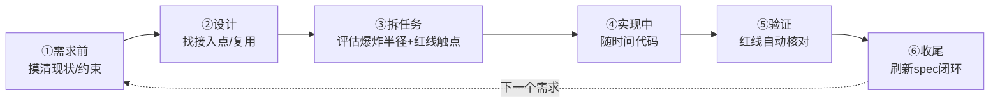
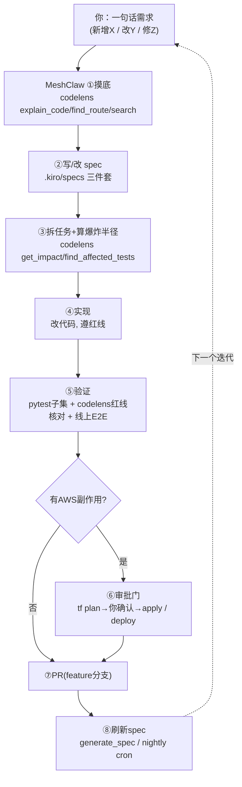
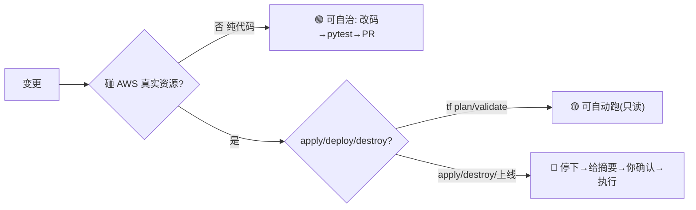

# 新功能开发 × CodeLens 生命周期 SOP（浪报 surf-forecast）

> 面向"新增功能/需求"的实操手册：把 CodeLens 21 工具嵌进 Kiro spec 驱动开发的每个阶段。
> **定位**：CodeLens 不写代码，它是你的**代码事实层**——需求前摸底、设计找接入点、改前算爆炸半径、改后守红线、收尾刷新 spec。
> 本文以 backlog 项「**多浪点横向对比**」为靶子，**①②③ 阶段附本机实跑的真实输出**（package `liangyimingcom/surf-forecast`，revision `527125044f30462a938e`）。
> 用法：新会话里自然语言直调（`用 codelens <工具> ...`），或 curl 直连（见 `codelens-meshclaw-integration.md` 附录 A）。

---

## 全生命周期总览



| 阶段 | 主用工具 | 产出 | 防止的坑 |
|------|----------|------|----------|
| ①需求前 | explain_code / search_spec_artifacts / get_specification_doc | 有据的 requirements.md | 重复造轮子、漏约束 |
| ②设计 | find_symbol / build_context / find_callers | 接入点明确的 design.md | 加错地方、动了不该动的 |
| ③拆任务 | get_impact / find_route / find_affected_tests | 带红线标记的 tasks.md | 低估爆炸半径 |
| ④实现 | explain_code / build_context | 顺畅实现 | 卡壳翻代码耗时 |
| ⑤验证 | find_route / search_spec_artifacts / get_impact | 红线核对表 | 线上 500 / SVG NaN / 401 漏保护 |
| ⑥收尾 | generate_spec / get_revision_metadata | 最新 spec 快照 | 后续查旧快照 |

---

## ① 需求前 —— 摸清现状与约束（实跑：explain_code）

**调用**
```
用 codelens explain_code 问：现在的浪报查询是单浪点还是支持多浪点？
后端 get_report 与 spot_registry 如何协作取数？DATA CONTRACT 里 days 是否含 wdeg？
```

**本机实跑真实返回（节选）**
> **支持多浪点**，"每用户多浪点 + 全局去重注册表"两级模型：
> - 完整 CRUD/切换：`GET/POST/PATCH/DELETE /api/spots` + `POST /api/spots/{slug}/select` [`src/web/app.py:139‑175`]，实现在 [`src/web/spots.py:31,91,102,120,131`]
> - 用户浪点按 email 隔离（`saved_spots` PK=email/SK=slug），free=3/paid=20 配额
> - 全局去重注册表 `spot_registry`：按 `round(lat,4)+round(lon,4)+facing` 去重，同坐标共享 slug+缓存，引用计数管理生命周期
> - **单次 `/api/report` 仍是针对一个浪点** [`src/web/app.py:83`]，但系统整体管理并刷新多点

**对"多浪点对比"需求的启示**：数据/存储层已支持多点，**缺口在**：① 一个能一次取多点的接口（或前端并发多次 `/api/report`）；② 前端对比视图。→ requirements.md 聚焦这两点，不必碰引擎/注册表。

---

## ② 设计 —— 找接入点、最大化复用（实跑：find_symbol + build_context）

**调用**
```
用 codelens find_symbol get_report
用 codelens build_context get_report
```

**本机实跑真实返回（节选）**
- `find_symbol` → `get_report` 定义在 [`src/web/deps.py:74`]，签名 `def get_report(lat, lon, days, spot) -> dict`
- `build_context` → **caller** 是 `report` [`src/web/app.py:84`]；关键 **callee**：`_resolve_slug`（先查注册表）[`deps.py:64`]、`find_spot` [`refresh.py:74`]、`get_store` [`db.py:287`]

**设计决策**：对比视图**复用 `get_report` 循环取多点**（每点走既有"注册表命中→读缓存→未命中回退引擎"路径），新增只做：
- 后端 `GET /api/report/compare?slugs=a,b,c`（内部对已选浪点循环调 `get_report`）
- 前端对比组件（复用现有 SVG 渲染，保证每点数组含 wdeg）
- **不动**引擎内核（physics/scoring/validate/analyze）

---

## ③ 拆任务 —— 算爆炸半径 + 标红线触点（实跑：get_impact）

**调用**
```
用 codelens get_impact get_report
用 codelens get_impact _to_decimal
```

**本机实跑真实返回（节选）**
- `get_impact get_report` → **radius 5，downstreamCount 66，upstreamCount 6**。下游深达引擎 `analyze.py`/`fetch.py`（`analyze_day`/`_score_point`/`build_lifecycle`…）。
  → **含义**：`get_report` 是高杠杆枢纽，**改它签名/行为会波及 66 个下游符号**。多浪点对比应**在其外层包一层**（新 compare 接口循环调用），**不改 `get_report` 本身**，把爆炸半径降到最小。
- `get_impact _to_decimal` → **upstream 4 个调用方**：`add_vote`[`db.py:189`]、`put_spot`[`db.py:201`]、`put_user`[`db.py:171`]、`upsert_registry`[`db.py:226`]。
  → **红线含义**：这 4 个就是当前**全部 DynamoDB 写路径**，都已过 `_to_decimal`。**若对比功能要落任何新表/新字段写入，必须新增经过 `_to_decimal` 的写函数**，否则线上 500（moto 不暴露）。

**tasks.md 红线标记**（据实跑得出）：
- [ ] compare 接口**只读**、循环复用 `get_report` — 不改其签名（避开 66 下游）
- [ ] 若写入新数据 → 必过 `_to_decimal`（对齐现有 4 个写路径）
- [ ] compare 接口带 `current_user` 依赖（401）
- [ ] compare 返回每点仍含 `wdeg` 数组（DATA CONTRACT）

---

## ④ 实现中 —— 卡壳随时问
```
用 codelens explain_code 问：新 compare 接口应复用哪个缓存读路径？未命中怎么回退？
用 codelens build_context render.py 里生成 SVG 数组字段的函数（保证对比数据无 NaN）
```

## ⑤ 验证 —— 红线变自动检查
```
用 codelens find_route              → 核对 /api/report/compare 有 current_user 依赖（401）
用 codelens search_spec_artifacts "wdeg"  → 确认对比数据每点含 wdeg
用 codelens get_impact _to_decimal  → 确认新写入（若有）已进 4 写路径之列
用 codelens find_affected_tests <改动符号>  → 只跑受影响的 pytest 子集
```
配合本地 `pytest`（子集）+ 线上 CloudFront 端到端。

## ⑥ 收尾 —— 刷新 spec 闭环
```
push 后 → nightly cron (2b5e1f8c) 自动 generate_spec 增量重生成
或手动 generate_spec(name="liangyimingcom/surf-forecast", branch="master")
→ get_revision_metadata 轮询至 SUCCESS
```
让下轮 `explain_code`/`get_impact` 基于最新代码事实。

---

## 心法（两条铁律）
1. **逆向 spec 是"现状"不是"意图"**：CodeLens 告诉你代码现在长什么样；红线意图仍以 `.kiro/steering` + `.kiro/specs` 为准，二者做 gap 核对而非互相覆盖。
2. **代码一改就刷新 spec**：spec 反映某个 commit；不刷新则 `explain_code`/`find_route` 查的是旧快照。

## 五条红线的 CodeLens 守护映射（速查）
| 红线 | 守护工具 |
|------|----------|
| GMT+8 日界 / 预报历史互斥 | `explain_code` + `search_spec_artifacts "GMT+8"` |
| DATA CONTRACT 含 wdeg | `search_spec_artifacts "wdeg"` |
| DynamoDB float→Decimal | `get_impact _to_decimal`（核对写路径全覆盖） |
| /api/spots 全 401 | `find_route` |
| slug 不可变 | `get_impact make_slug` / `find_callers` |

_本文 ①②③ 输出为 2026-07-10 本机对 revision 527125…的真实实跑结果。_

---

# 附录 C — 用 MeshClaw 完成功能迭代的完整操作矩阵

> 从"新增/修改功能"的角度，给出**如何操作 MeshClaw（对它说什么、它做什么）**完成一次功能迭代的标准步骤，并覆盖各类变更的完整矩阵，供学习与模仿。
> 核心心智：**你只描述"要什么"，MeshClaw 用 CodeLens 摸底 → spec 驱动开发 → 验证守红线 → PR → 刷新 spec**。CodeLens 是事实层，MeshClaw 是执行编排层。

## C.1 MeshClaw 功能迭代标准闭环



**你对 MeshClaw 的话术模板**（越具体越好）：
```
我要<新增/修改/修复> <功能>，目标是 <价值/行为>。
先用 codelens 摸清现状和影响面，改 spec，拆任务标红线，实现后跑验证，
纯代码就开 PR；碰 AWS 先给我 plan 等我确认。
```

## C.2 完整变更类型矩阵

> 风险：🟢低(纯代码可自治) 🟡中(需留意红线/依赖) 🔴高(AWS副作用/需审批门)。
> "MeshClaw 步骤"列均隐含：摸底→spec→实现→验证→PR/审批→刷新spec。

| # | 变更类型 | 典型示例 | 主用 CodeLens 工具 | 关键红线/审批 | 验证方式 | 风险 |
|---|----------|----------|-------------------|--------------|----------|:---:|
| 1 | 纯前端新增 | 多浪点对比视图、收藏夹面板 | explain_code, find_symbol(前端锚点), search "SPOT" | DATA CONTRACT 含 wdeg、图表数字无 NaN | `node --check` + 浏览器 0 报错 | 🟢 |
| 2 | 纯前端改造 | 图表配色/布局、响应式 | build_context(渲染函数) | 不破 SVG 数字契约 | 视觉走查 + 控制台 0 error | 🟢 |
| 3 | 后端新增接口 | `GET /api/report/compare` | build_context(get_report), find_route | 新路由全 401、复用只读 | pytest 新增 test_* + find_route 核对 | 🟢 |
| 4 | 后端改逻辑 | 缓存 TTL、配额 free=5 | get_impact(目标函数), find_callers | 不改 get_report 签名(66下游) | pytest 子集 | 🟢 |
| 5 | 引擎阈值调整 | 改 `config/thresholds.yaml` 离岸档 | explain_code(score_wind) | 只改 yaml 不硬编码、引擎内核不动 | test_scoring/test_golden | 🟢 |
| 6 | 引擎新增评分维度 | 新增"水温"评分 | build_context(scoring/composite), get_impact | 纯函数、阈值进 yaml、golden 更新 | test_scoring + golden 重算 | 🟡 |
| 7 | 数据层新表/字段 | saved_spots 加 `rating` | get_impact(_to_decimal), find_callers | **写入必过 float→Decimal**、slug 不变 | moto 单测 + 线上写读 | 🟡 |
| 8 | 数据层 schema 迁移 | 拆表/改 PK | get_impact(put_*), find_route | Decimal + 迁移脚本 + 回滚 | 迁移演练 + 线上核对 | 🔴 |
| 9 | IaC 新增资源 | 新 DynamoDB 表/S3 桶 | search_spec_artifacts(iac), find_route | **tf apply 禁 auto-approve**、SG 无 0.0.0.0/0、replace 竞态 | tf validate→plan→你确认→apply | 🔴 |
| 10 | 定时/刷新变更 | 改 EventBridge 频率、冷点回收 | build_context(scheduled_refresh) | validate 守门、失败不覆盖、GMT+8 | test_refresh + 手动 RunTask | 🟡 |
| 11 | 鉴权/安全变更 | 新增角色、改会话 | find_route(全路由), explain_code(auth) | 全后端鉴权、前端零信任、密钥走 Secrets | test_auth/test_security | 🔴 |
| 12 | Bug 修复 | 复现线上 500/SVG NaN | get_impact(疑点), find_affected_tests | 先加复现测试再修 | 复现测试转绿 + 回归子集 | 🟡 |
| 13 | 依赖升级 | pydantic/fastapi 升级 | find_affected_tests | 锁版本、破坏性变更评估 | 全量 pytest 118 | 🟡 |
| 14 | 文档/spec 变更 | 补 spec、写 runbook | get_specification_doc(对齐) | 意图以手写 spec 为准 | 人工评审 | 🟢 |
| 15 | 性能优化 | 缓存命中、查询批量 | get_impact, build_context | 读写解耦、<500ms | 压测 + pytest | 🟡 |
| 16 | 镜像/部署 | 新镜像上线 | — | 临时 t4g EC2 构建、rollout 监控 | deploy.sh smoke + 线上 E2E | 🔴 |

## C.3 分类 worked examples（"你说的话" → "MeshClaw 做的事"）

### 例 A｜纯前端新增（🟢）：多浪点对比视图
**你说**：`新增多浪点对比视图，会员能同屏对比已保存的 2-3 个浪点的评分与浪高。先摸底再改 spec，实现后验证，纯代码开 PR。`
**MeshClaw 做**：
1. `explain_code` 确认多点数据已就绪、`/api/report` 单点 → 缺前端组件（见附录本文①②③）
2. 改 `.kiro/specs/custom-spots`（或新 spec）requirements/design：附加式对比组件，复用 SVG 渲染
3. `get_impact get_report` 确认只读复用、不改签名 → tasks.md 标"含 wdeg/401"
4. 实现前端组件 + （可选）`/api/report/compare` 循环调 get_report
5. 验证：`node --check` + `find_route` 核对 compare 401 + pytest + 浏览器 0 报错
6. feature 分支 PR → 合并后刷新 spec

### 例 B｜引擎阈值调整（🟢）：离岸加成从 1 档改 2 档
**你说**：`把离岸风加成从升 1 档改成 2 档，只改配置不动代码。`
**MeshClaw 做**：`explain_code score_wind` 确认加成读 `offshore_bonus_band` → **只改 `config/thresholds.yaml`** → `test_scoring`/`test_golden`（golden 需重算并人工确认新排名合理）→ PR。**红线**：绝不把阈值硬编码进 scoring.py。

### 例 C｜数据层加字段（🟡，最易踩坑）：saved_spots 加 rating
**你说**：`给保存的浪点加一个用户评分 rating 字段并持久化。`
**MeshClaw 做**：
1. `get_impact _to_decimal` → 得知写路径 = `add_vote/put_spot/put_user/upsert_registry` 四函数
2. 改 `put_spot` 写入 rating，**确认经 `_to_decimal`**（否则线上 500，moto 不暴露）
3. spots.py/spots_model.py 加校验；PATCH 保持 slug 不变
4. 验证：moto 单测 + **线上真实写读一次**（moto 盲区）→ PR
**红线**：float→Decimal（本项目头号坑）。

### 例 D｜后端新增接口（🟢）：批量对比接口
**你说**：`加 GET /api/report/compare?slugs=a,b,c 返回多点浪报。`
**MeshClaw 做**：`build_context get_report` → 写循环调用的只读接口 + `current_user` 依赖 → `find_route` 核对 401 → `test_compare` → PR。

### 例 E｜IaC 新增资源（🔴，审批门）：新增浪点热度统计表
**你说**：`新增一张 DynamoDB 表存浪点访问热度。`
**MeshClaw 做**：
1. `search_spec_artifacts` 看现有 storage module 模式
2. 改 `iac/terraform/modules/storage` 加表（on-demand/PITR/PK，注意 create_before_destroy 防 replace 竞态）+ 后端 IAM
3. `terraform validate` → **`terraform plan` 给你摘要 → 停下等你确认** → `echo yes | terraform apply`
4. 后端写入过 `_to_decimal`；ALB SG 保持仅 pl-58a04531
**审批门**：apply 禁 -auto-approve，必须你人工授权。

### 例 F｜Bug 修复（🟡）：某浪点 SVG 显示 NaN
**你说**：`石老人浪点前端图表出现 NaN，帮我修。`
**MeshClaw 做**：
1. `search_spec_artifacts "wdeg"` + `explain_code` 定位 DATA CONTRACT 哪个数组可能为 None
2. **先写一个复现该点的测试**（红→）
3. 修引擎/渲染，保证数组字段全数字
4. 复现测试转绿 + `find_affected_tests` 跑回归子集 → PR
**红线**：图表字段(times/windows/tideEvents/hs/wind/gust/wdeg)必为数字。

### 例 G｜定时刷新变更（🟡）：刷新频率改 3 次/日
**你说**：`每日刷新从 2 次改 3 次，加一个 20:00 窗口。`
**MeshClaw 做**：`build_context scheduled_refresh` → 改 EventBridge cron（GMT+8）+ 刷新逻辑复用 → `test_refresh`（失败不覆盖上一版）→ 属 IaC 变更走 plan→确认→apply。

## C.4 风险分级与审批门（务必遵守）


- 🟢 纯代码（引擎/web/前端/测试/文档）：MeshClaw 可全自治推进。
- 🟡 只读 AWS（describe/plan/validate/smoke）：可自动跑。
- 🔴 有副作用（terraform apply/destroy、deploy 上线、镜像推送、数据迁移）：**必须人工审批**，禁 `-auto-approve`。

## C.5 反模式清单（别让 MeshClaw 这么干）
- ❌ 改 `get_report` 签名（66 个下游，爆炸半径巨大）→ 应外层包新接口。
- ❌ 新 DynamoDB 写入不过 `_to_decimal`（线上 500，moto 不暴露）。
- ❌ 阈值硬编码进 scoring.py（应只改 `thresholds.yaml`）。
- ❌ 动引擎内核 physics/scoring/validate 的纯函数逻辑去迁就叙事。
- ❌ 新路由漏 `current_user`（/api/* 应全 401）。
- ❌ ALB SG 加 0.0.0.0/0；`terraform apply -auto-approve`。
- ❌ 改完代码不刷新 spec，导致下轮 codelens 查旧快照。
- ❌ 直接 push master（走 feature 分支 + PR）。

## C.6 一次迭代的最小命令流（速记）
```
# 摸底
用 codelens explain_code / find_route / get_impact 摸清现状与影响面
# 改码后本地验证
cd .../surf-forecast-kiro-v2 && source .venv/bin/activate && python -m pytest -q   # 或子集
# 红线核对
用 codelens find_route (401) / search_spec_artifacts "wdeg" / get_impact _to_decimal
# 提交(合规走 PR)
git checkout -b feat/xxx && git commit && git push -u origin feat/xxx && gh pr create
# 刷新 spec (合并后)
generate_spec(name="liangyimingcom/surf-forecast", branch="master")  # 或等 nightly cron
```

_附录 C 面向"用 MeshClaw 做功能迭代"的操作参考；红线与审批门与 north_star/steering 一致。_
