# CodeLens × MeshClaw × surf-forecast 整合方案全景

> 目的：探讨 **CodeLens 的 spec 生成能力** 如何与 **MeshClaw 自治代理平台** 及 **surf-forecast 项目** 结合，穷举可行的接入、触发、闭环、知识化与编排方案。
> 事实来源：① 阅读 CodeLens 源码 `github.com/liangyimingcom/codelens`（`backend/codelens/{pipeline,coordinator,api,mcp_server,settings,incremental}.py`）；② 实盘调用其 MCP（21 工具 + REST API）；③ surf-forecast 已由 CodeLens 成功生成 spec（package `8e816376…`，revision `527125…`，SUCCESS）。
> 环境：CodeLens 部署于 `us-east-1`（CloudFront `d1t9q5qxrql3xj`，Bearer 鉴权）；surf-forecast 生产于 `ap-northeast-1`；GitHub `liangyimingcom/surf-forecast`（已 public）。

---

## 0. 两个系统的能力底座

### 0.1 CodeLens 提供什么（读码结论）

| 能力面 | 具体产物/工具 | 源码位置 |
|--------|--------------|----------|
| **生成管线** | `intake→code_map→inspect→author→done`，5 阶段带进度；**渐进复用**（按 commit diff 只重算变更符号，`_reuse_context`/`_commit_diff`） | `pipeline.py` |
| **文档产物** | `specification.md`(SRS) / `system-overview.md` / `api-guide.md` / `developer-docs.md` / `usage-guide.md` / `structure-map.md` | `authoring.py` |
| **代码图** | `find_symbol` / `find_callers` / `find_callees` / `get_impact`(爆炸半径) / `find_route`(HTTP路由) / `find_affected_tests` / `build_context` | `codegraph/*` |
| **知识问答** | `explain_code`(NL 问答, 向量检索 AOSS) / `search_spec_artifacts` | `explainer.py` `search.py` |
| **跨包** | collections：多仓库分组 → `collection-overview/architecture` 跨包文档 | `collections.py` |
| **接入面 A：MCP** | 21 工具，streamable-HTTP，`/mcp/` + `Bearer` | `mcp_server.py` |
| **接入面 B：REST** | `POST /api/spec-packages`(202) / `/api/revisions/{id}`(状态) / `/artifacts` / `/export` / `/cancel` / `/resume` / `/graph/*` / collections | `api.py` |
| **质量增强** | `REVIEW_DOCS` 多轮评审、`DOC_WRITER_AGENT`、`API_GUIDE_AGENT`、Opus/Sonnet 分层 | `settings.py` `review.py` |

### 0.2 MeshClaw 提供什么（编排/自治底座）

| 能力 | 用途 |
|------|------|
| `cron_add`（script/command 型 = 零 token） | 定时/轮询触发 CodeLens |
| `spawn_run` | 并行 fan-out（多分支/多仓库同时分析） |
| `workflow_run` | 多阶段、可监控、可重跑的动态工作流 |
| Heartbeat（`HEARTBEAT.md`） | 长任务轮询直到完成 |
| `register_hook` + webhook | 外部系统（GitHub/CI）回调注入会话 |
| `learn_add` / 工作区记忆 | 把 spec 结论固化为跨会话知识 |
| `artifact_save` / 本地知识库 | 持久化 CodeLens 产物、可检索 |
| `send_message` | 结果推送 Slack/dashboard |

### 0.3 整体上下文图

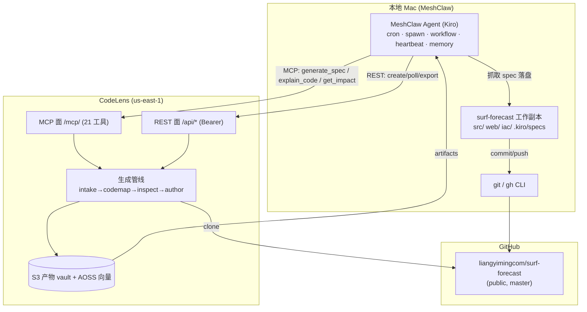

---

## 1. 方案分层总览

按"接入 → 触发 → 闭环 → 知识化 → 编排 → 质量"六层展开，共 **18 个方案**。

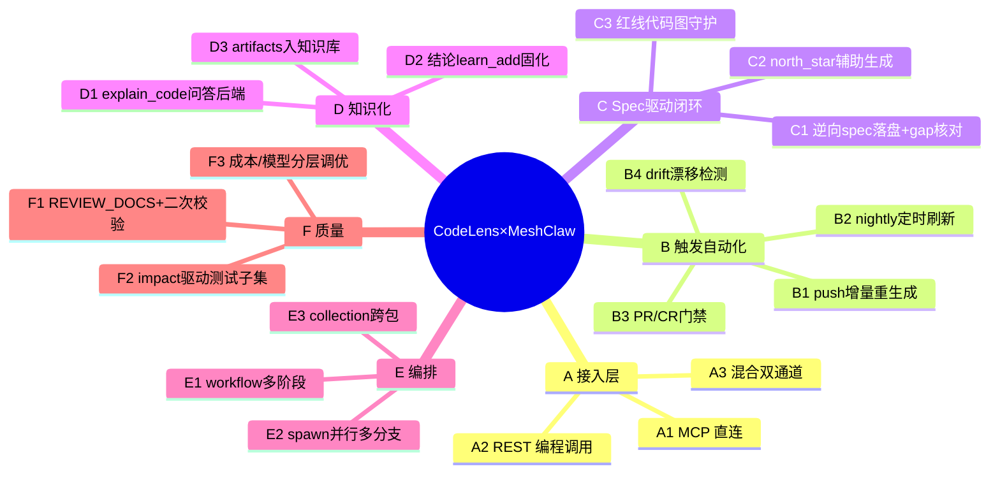

---

## 2. A 层 — 接入方式（三选一或混用）

### A1. MCP 直连（交互式，零本地安装）

把 CodeLens 21 工具挂到 Kiro/MeshClaw，会话中自然语言即可调用。

写入 `~/.kiro/settings/mcp.json`：
```jsonc
{
  "mcpServers": {
    "codelens": {
      "url": "https://d1t9q5qxrql3xj.cloudfront.net/mcp/",
      "headers": { "Authorization": "Bearer tok-***" },
      "autoApprove": ["get_specification_doc","explain_code","find_symbol",
                      "build_context","find_route","search_spec_artifacts"]
    }
  }
}
```
- **优点**：即插即用，21 工具直接进 agent 工具面；交互查询最顺手。
- **缺点**：MeshClaw 后台 cron 里不一定加载 Kiro mcp.json；自动化需 A2。

### A2. REST 编程调用（自动化/编排首选）

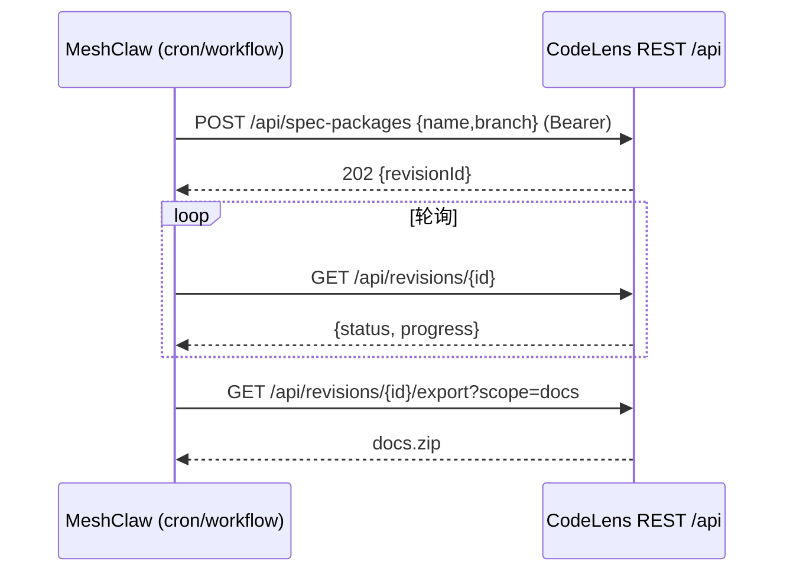
- 端点：`create_package` / `revisions/{id}` / `/artifacts` / `/export` / `/graph/{op}` / `/cancel` / `/resume`。
- **优点**：脚本化、可放进 script-cron（零 token）、可导出 zip。

### A3. 混合双通道（推荐）

- **交互查询走 MCP**（explain_code/find_symbol，人在环）。
- **自动化编排走 REST/MCP-over-curl**（cron/workflow 触发 generate_spec + 轮询）。

---

## 3. B 层 — 触发与自动化（MeshClaw 驱动 CodeLens）

### B1. push 触发增量重生成 ⭐（最高杠杆）

利用 CodeLens 的 commit-diff 渐进复用：每次 push 后只重算变更符号，秒级增量。

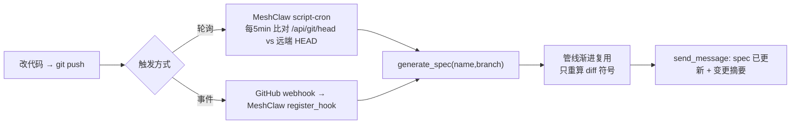
- **实现**：`cron_add(script=...)` 调 MCP `generate_spec`；`get_revision_metadata` 轮询；完成后 `explain_code("本次变更影响了哪些模块")` 生成摘要推送。
- **红线联动**：变更命中 `db.py` → 自动提醒 float→Decimal；命中 `spots.py` 路由 → `find_route` 复核全 401。

### B2. nightly 定时全量刷新

```
cron_add(name="codelens-nightly", cron_expr="0 3 * * *", timezone="Asia/Shanghai",
         script="~/.meshclaw/crons/codelens_gen.py:run",
         message='{"name":"liangyimingcom/surf-forecast","branch":"master"}')
```
- script-cron 零 token；每晚重生成，保证 spec 与主干同步。

### B3. PR / CR 门禁

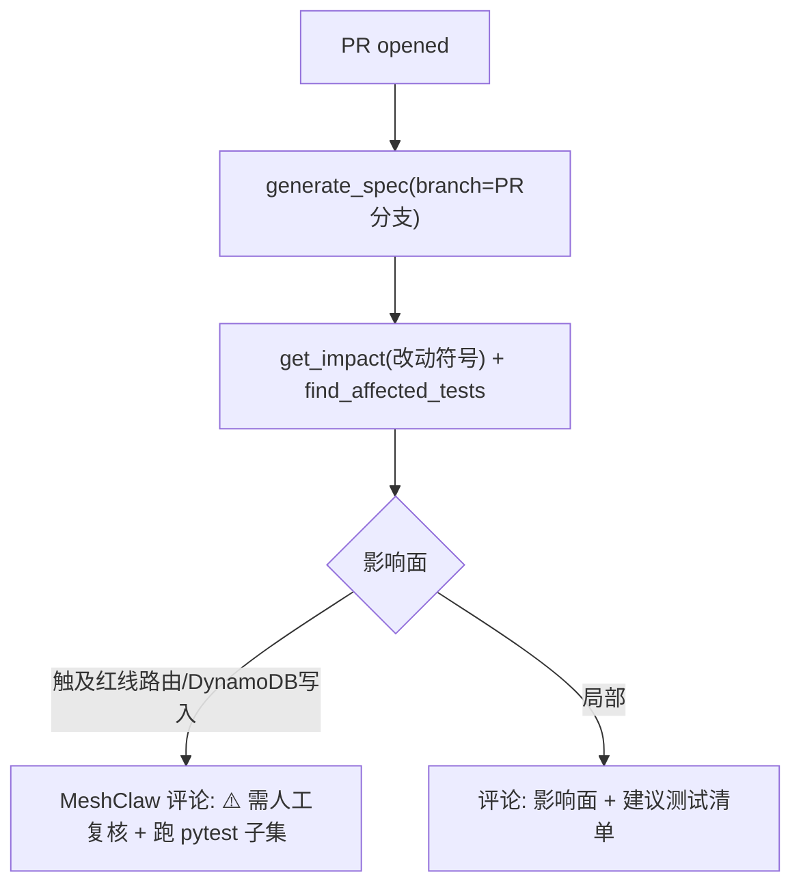
- MeshClaw 用 `gh pr comment` 回帖；`find_affected_tests` 决定只跑受影响的 pytest 子集。

### B4. drift 漂移检测

- 定期对比 CodeLens 逆向 `specification.md` 与手写 `.kiro/specs/*` + `steering` 红线：
  - 引擎是否仍每日含 `wdeg`？(`search_spec_artifacts "wdeg"`)
  - `/api/spots` 是否仍全 401？(`find_route`)
  - GMT+8 日界约束是否被逆向捕捉？
- 差异 → `send_message` 告警 + 建议修 spec 或修码。

---

## 4. C 层 — Spec 驱动开发闭环（CodeLens spec ↔ Kiro spec）

### C1. 逆向 spec 落盘 + 双向 gap 核对 ⭐

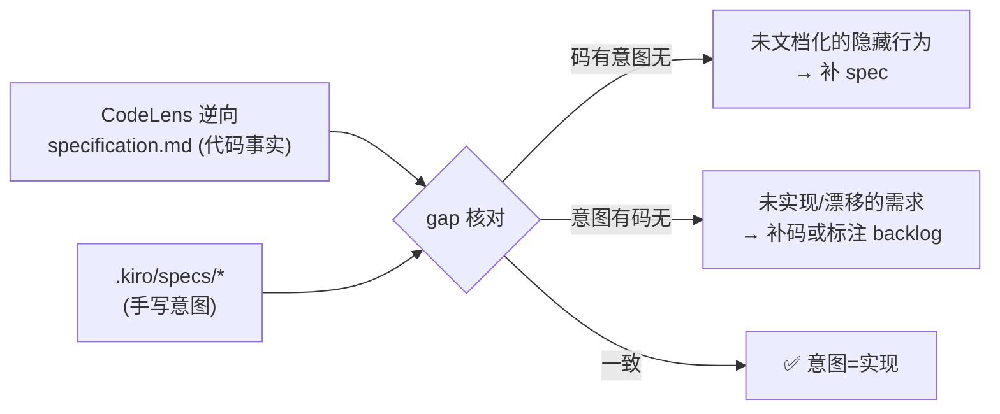
- 把 CodeLens 7 份文档抓到 `docs/codelens/`，与 5 个手写 spec 三件套逐条比对，产出 gap 报告（复用项目已有的 `production-gap-analysis.md` 范式）。

### C2. north_star 辅助生成

- 定新目标时，先 `explain_code("当前系统有哪些薄弱点/未覆盖的边界？")` + `get_impact` 评估候选改动爆炸半径 → 据此写 `north_star.md`，让自治循环目标更贴合真实代码。

### C3. 红线的代码图守护

| surf-forecast 红线 | CodeLens 校验工具 |
|--------------------|-------------------|
| `/api/spots` 全 401 | `find_route` 列出所有路由核对鉴权依赖 |
| DynamoDB 写入 float→Decimal | `find_callers("_to_decimal")` / `get_impact` 确认写路径都经过 |
| DATA CONTRACT 含 wdeg | `search_spec_artifacts "wdeg"` / `find_symbol("render")` |
| slug 不可变 | `get_impact("make_slug")` 追踪缓存键引用 |
| 引擎内核不动 | `find_callers` 监控 physics/scoring/validate 被改动波及 |

---

## 5. D 层 — 知识化（CodeLens 作为 MeshClaw 的代码大脑）

### D1. explain_code 作为项目问答后端（RAG）

```mermaid
flowchart LR
  user["用户在 MeshClaw 提问<br/>'离岸风质加成怎么算的?'"] --> mc["MeshClaw"]
  mc -->|explain_code(package, question)| cl["CodeLens 向量检索 AOSS<br/>+ Opus 作答"]
  cl -->|带引用的答案| mc --> user
```
- 把 CodeLens 当作 surf-forecast 的"活文档问答"，替代人肉翻代码。

### D2. 关键结论 learn_add 固化

- 从 `system-overview.md` 抽取跨会话事实（架构、红线）→ `learn_add(scope=workspace)`（已在本项目播种红线）。

### D3. artifacts 入本地知识库

- `export?scope=docs` 抓 zip → `artifact_save` 或存入 MeshClaw 知识库 → `local_knowledge_search` 可离线检索。

---

## 6. E 层 — 编排（MeshClaw 高阶自治）

### E1. workflow_run 多阶段动态工作流 ⭐

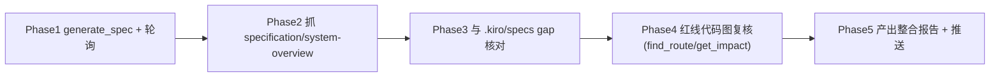
- 一条可监控、可从任一 phase 重跑的工作流；`workflow_run(intent="给 surf-forecast 生成spec并做gap分析出报告")`。

### E2. spawn_run 并行多分支/多仓库

- 同时对 `master` / `feature-*` / 其它仓库 `generate_spec`，结果并回，横向对比。

### E3. collection 跨包架构文档

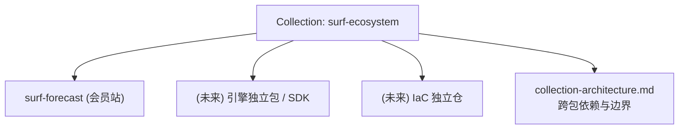
- 当项目拆分为多仓库时，用 collection 生成跨包总览。

---

## 7. F 层 — 质量增强

### F1. 多轮评审 + MeshClaw 二次校验
- 开 `CODELENS_REVIEW_DOCS=1 REVIEW_DOC_IDS=specification,api-guide` → CodeLens 内部多轮自评；MeshClaw 再用红线清单复核逆向 spec 是否漏了 GMT+8/wdeg。

### F2. impact 驱动测试子集
- 改动 → `find_affected_tests` → 只跑受影响 pytest（118 全量 → 子集），CI 更快。

### F3. 成本/模型分层调优
- `LLM_FANOUT`↑ 提速但增成本；小改用增量复用避免全量重算；`MODEL_LIGHT`(Sonnet) 跑 inspect、`MODEL_PRIMARY`(Opus) 跑 author。
- ⚠️ CodeLens 固定月成本 ≈ $765（AOSS 占 ~90%）；高频 generate 只增 Bedrock token，可控。

---

## 8. 方案对比矩阵

| # | 方案 | 触发者 | 接入面 | MeshClaw 能力 | 自治度 | 成本 | 落地难度 | 杠杆 |
|---|------|--------|--------|--------------|--------|------|----------|------|
| A1 | MCP 直连 | 人 | MCP | mcp.json | 手动 | 低 | ★☆☆ | 中 |
| A2 | REST 编程 | 脚本 | REST | cron/script | 高 | 低 | ★★☆ | 中 |
| B1 | push 增量重生成 | git push | MCP/REST | cron+hook | 高 | 低(增量) | ★★☆ | **高** |
| B2 | nightly 刷新 | 定时 | MCP | script-cron | 高 | 低 | ★☆☆ | 中 |
| B3 | PR/CR 门禁 | PR | REST+图 | hook+gh | 高 | 中 | ★★★ | **高** |
| B4 | drift 检测 | 定时 | MCP | cron+memory | 高 | 低 | ★★☆ | 中 |
| C1 | 逆向spec+gap核对 | 人/定时 | MCP | 对比+报告 | 半 | 低 | ★★☆ | **高** |
| C2 | north_star 辅助 | 人 | MCP | explain_code | 半 | 低 | ★☆☆ | 中 |
| C3 | 红线代码图守护 | 改动 | 代码图 | workflow | 高 | 低 | ★★☆ | **高** |
| D1 | explain 问答后端 | 人 | MCP | 会话 | 手动 | 低(token) | ★☆☆ | 中 |
| D2 | 结论 learn_add | 人/自动 | MCP | 记忆 | 半 | 低 | ★☆☆ | 中 |
| D3 | artifacts 知识库 | 定时 | REST | artifact_save | 高 | 低 | ★★☆ | 中 |
| E1 | workflow 多阶段 | 人/事件 | 双通道 | workflow_run | 高 | 中 | ★★★ | **高** |
| E2 | spawn 并行多分支 | 人 | REST | spawn_run | 高 | 中 | ★★☆ | 中 |
| E3 | collection 跨包 | 人 | REST | — | 半 | 中 | ★★☆ | 低(当前单仓) |
| F1 | 多轮评审+复核 | 定时 | 配置 | 校验 | 半 | 中 | ★★☆ | 中 |
| F2 | impact 测试子集 | 改动 | 代码图 | pytest | 高 | 低 | ★★☆ | 中 |
| F3 | 模型分层调优 | 配置 | 配置 | — | — | 降本 | ★☆☆ | 中 |

---

## 9. 推荐落地路线（分阶段）

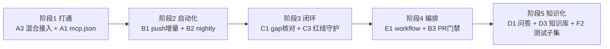

1. **阶段1（今天可做）**：配 `mcp.json`（A1）+ 保留 REST 脚本（A2）→ 混合接入 A3。
2. **阶段2**：`cron_add` 挂 push 增量重生成（B1）与 nightly（B2），零/低 token。
3. **阶段3**：把逆向 spec 落 `docs/codelens/`，跑 gap 核对（C1）与红线代码图守护（C3）。
4. **阶段4**：`workflow_run` 串成多阶段报告（E1）；接 PR 门禁（B3）。
5. **阶段5**：explain_code 问答（D1）、artifacts 入知识库（D3）、impact 驱动测试子集（F2）。

---

## 10. 关键约束与注意

- **私有仓库**：CodeLens 用自身 GitHub token，克隆私有库会 404 → 要么仓库 public，要么给 CodeLens 配 `GITHUB_TOKEN`（`settings.py:32`）能访问该私有库的 PAT。本项目已选 public。
- **凭证安全**：CodeLens Bearer 令牌 + admin 密码勿入库；MeshClaw 侧存 env/secret，不明文写进 cron message。
- **成本**：AOSS 是固定大头(~$700/月)；generate 频率只影响 Bedrock token。高频增量复用可控。
- **时区**：surf-forecast 全程 GMT+8；CodeLens 部署在 us-east-1，cron 触发注意 `timezone="Asia/Shanghai"`。
- **红线不可外包给逆向**：CodeLens 逆向 spec 是"代码事实"，surf-forecast 的意图红线仍以手写 `.kiro/steering` + `.kiro/specs` 为准；两者做 gap 核对而非互相覆盖。

---

_生成：MeshClaw × Kiro，基于对 codelens 源码的直接阅读 + MCP/REST 实盘。_

---

# 附录 A — 价值说明、举例与可操作 Sample

> 本附录回答三问：**为什么值得做（价值）**、**长什么样（举例）**、**怎么上手（可复制的步骤/命令）**。所有示例基于真实产物：MCP `https://d1t9q5qxrql3xj.cloudfront.net/mcp/`、package `liangyimingcom/surf-forecast`、已 SUCCESS 的 revision。

## A.0 一句话价值

> **让"代码的真实事实"以最低人力持续反哺"开发的意图与自治循环"** —— CodeLens 把代码逆向成可查询的 spec + 代码图，MeshClaw 把它变成会自动触发、会守红线、会答疑、会进记忆的闭环。

## A.1 价值总览（痛点 → 收益）

| 现状痛点（surf-forecast 真实经历） | 结合后的收益 | 支撑方案 |
|-----------------------------------|-------------|----------|
| DynamoDB float→Decimal 漏写导致**线上 500**，moto 单测不暴露 | 每次改 `db.py`/新增写路径 → `get_impact("_to_decimal")` 自动核对写路径是否都过转换 | C3 / B1 |
| 前端 SVG 因缺 `wdeg`/NaN 报错，靠人肉查 DATA CONTRACT | `search_spec_artifacts "wdeg"` + drift 检测，逆向 spec 缺 wdeg 即告警 | B4 / C1 |
| 改一处不知波及范围，只能全量跑 118 测试 | `find_affected_tests` 只跑受影响子集，CI 更快 | F2 |
| 新人/未来的你看不懂"离岸风质加成"逻辑，翻代码耗时 | `explain_code` 带引用秒答 | D1 |
| 手写 `.kiro/specs` 与代码逐渐漂移，无人对账 | 逆向 spec × 手写 spec 双向 gap 核对出报告 | C1 |
| spec 更新靠人记得跑 | push 后自动增量重生成（commit-diff 复用，秒级） | B1 |
| 定新 north_star 拍脑袋 | `explain_code("薄弱点/未覆盖边界?")` 辅助 | C2 |

## A.2 三个"举例说明"（把价值讲具体）

### 例 1：一次 `db.py` 改动，红线守护如何救场
场景：给 `saved_spots` 增加一个 `rating: float` 字段并写库。
- **没有结合**：本地 moto 测试全绿 → 上线 → boto3 resource 拒绝 float → **线上 500**（项目真实踩过的坑）。
- **结合后（C3+B1）**：push 触发增量重生成 → MeshClaw 跑
  `get_impact("_to_decimal")` 与 `find_callers` 确认新写路径**未**经过 `_to_decimal` → 立即
  `send_message("⚠️ 新增 rating 写入未过 float→Decimal，会 500")`，上线前拦截。

### 例 2：问一句就懂"离岸风质加成"
- 直接问 MeshClaw：「离岸风的风质加成是怎么算的，阈值在哪配？」
- MeshClaw 调 `explain_code(package="liangyimingcom/surf-forecast", question=...)` →
  CodeLens 向量检索 + Opus 作答：指向 `scoring.py::score_wind`（离岸放宽一档）+ `config/thresholds.yaml:spot_facing_deg=157/offshore_bonus_band` —— 带文件引用，无需翻代码。

### 例 3：PR 门禁自动列"该跑哪些测试"
- 开一个改 `render.py` 的 PR → MeshClaw
  `find_affected_tests("render")` → 回帖：「本 PR 影响 `test_golden`、`test_contract`、`test_render`；建议 `pytest tests/test_golden.py tests/test_contract.py` 优先」。省去全量 118 + 人肉判断。

## A.3 可操作 Sample（可直接复制）

### Sample 1 — 配置 MCP 接入（阶段1）
写 `~/.kiro/settings/mcp.json`（或工作区 `.kiro/settings/mcp.json`）：
```jsonc
{
  "mcpServers": {
    "codelens": {
      "url": "https://d1t9q5qxrql3xj.cloudfront.net/mcp/",
      "headers": { "Authorization": "Bearer <你的_ServiceToken>" },
      "disabled": false,
      "autoApprove": ["get_specification_doc","explain_code","find_symbol",
                      "build_context","find_route","get_impact","find_affected_tests",
                      "search_spec_artifacts"]
    }
  }
}
```
> 令牌勿明文入库。reconnect MCP 后，会话里可直接说「用 codelens 解释 X」。

### Sample 2 — curl 直调 MCP（无需 Kiro，脚本可用）
```bash
CF=https://d1t9q5qxrql3xj.cloudfront.net; TOKEN=<ServiceToken>
# 1) initialize 拿 session
SID=$(curl -sD - -o /dev/null -X POST $CF/mcp/ -H "Authorization: Bearer $TOKEN" \
  -H "Content-Type: application/json" -H "Accept: application/json, text/event-stream" \
  -d '{"jsonrpc":"2.0","id":1,"method":"initialize","params":{"protocolVersion":"2024-11-05","capabilities":{},"clientInfo":{"name":"cli","version":"1"}}}' \
  | awk -F': ' '/mcp-session-id/{print $2}' | tr -d '\r')
# 2) 调用某工具（示例：查所有 HTTP 路由核对 401）
curl -s -X POST $CF/mcp/ -H "Authorization: Bearer $TOKEN" -H "mcp-session-id: $SID" \
  -H "Content-Type: application/json" -H "Accept: application/json, text/event-stream" \
  -d '{"jsonrpc":"2.0","id":2,"method":"tools/call","params":{"name":"find_route","arguments":{"package_name":"liangyimingcom/surf-forecast"}}}'
```

### Sample 3 — push 触发增量重生成（script-cron，零 token）
① 写脚本 `~/.meshclaw/crons/codelens_gen.py`：
```python
import json, httpx
CF = "https://d1t9q5qxrql3xj.cloudfront.net/mcp/"
TOKEN = __import__("os").environ["CODELENS_TOKEN"]   # 从环境注入，勿硬编码
H = {"Authorization": f"Bearer {TOKEN}", "Content-Type": "application/json",
     "Accept": "application/json, text/event-stream"}
def _sse(t):
    for l in t.splitlines():
        if l.startswith("data:"):
            try: return json.loads(l[5:].strip())
            except: pass
    return {}
def _mcp(client, sid, tool, args):
    h = dict(H); h["mcp-session-id"] = sid
    r = client.post(CF, headers=h, json={"jsonrpc":"2.0","id":9,"method":"tools/call",
        "params":{"name":tool,"arguments":args}})
    return _sse(r.text)["result"]["structuredContent"]["result"]
def run(ctx):
    args = json.loads(ctx.message or '{}')
    name = args.get("name", "liangyimingcom/surf-forecast")
    branch = args.get("branch", "master")
    with httpx.Client(timeout=60) as c:
        r = c.post(CF, headers=H, json={"jsonrpc":"2.0","id":1,"method":"initialize",
            "params":{"protocolVersion":"2024-11-05","capabilities":{},"clientInfo":{"name":"cron","version":"1"}}})
        sid = r.headers.get("mcp-session-id")
        c.post(CF, headers={**H, "mcp-session-id": sid},
               json={"jsonrpc":"2.0","method":"notifications/initialized"})
        out = _mcp(c, sid, "generate_spec", {"name": name, "branch": branch})
    ctx.notify(f"CodeLens 已触发增量重生成 {name}@{branch}: {out}")
```
② 注册 cron（每晚 3 点北京时间 nightly；push 触发可改 webhook）：
```
cron_add(
  name="codelens-nightly-surf",
  cron_expr="0 3 * * *", timezone="Asia/Shanghai",
  script="~/.meshclaw/crons/codelens_gen.py:run",
  message='{"name":"liangyimingcom/surf-forecast","branch":"master"}',
  minimal_context=true, hide_in_chat=true)
```

### Sample 4 — 红线代码图守护（改动后自查）
在会话/工作流里对 CodeLens 连续查询：
```
find_route(package_name="liangyimingcom/surf-forecast")
  → 核对所有 /api/spots* 路由是否带 current_user 鉴权依赖（应全 401）
get_impact(target="_to_decimal", package_name="liangyimingcom/surf-forecast")
  → 列出所有 DynamoDB 写路径，确认新增写入都经过它
search_spec_artifacts(package_name="liangyimingcom/surf-forecast", query="wdeg")
  → 确认 DATA CONTRACT 逆向 spec 仍含 wdeg
get_impact(target="make_slug", ...)  → 确认 slug 仍是唯一缓存键，无第二处生成
```

### Sample 5 — 一条动态工作流跑完"生成→gap→报告"
```
workflow_run(intent="对 liangyimingcom/surf-forecast 用 CodeLens 生成/刷新 spec，
抓取 specification.md 与 system-overview.md，与本地 .kiro/specs/* 及 steering 红线
（GMT+8/含wdeg/DynamoDB float→Decimal/api-spots全401/slug不可变）逐条 gap 核对，
用 find_route 与 get_impact 复核红线，最后产出中文整合报告并推送。")
```
> 返回 run_id，可在 Workflows 面板看进度、从任一 phase 重跑。

### Sample 6 — PR 门禁回帖（GitHub）
```bash
# CI/hook 里：对 PR 分支生成 → 查影响面 → 回帖
BR=$(gh pr view <PR> --json headRefName -q .headRefName)
# (调 MCP generate_spec branch=$BR，轮询 SUCCESS，然后:)
#   find_affected_tests(target=<改动符号>) → $TESTS
gh pr comment <PR> --body "🤖 CodeLens 影响分析：本 PR 影响 $TESTS。建议优先跑这些 pytest 子集；若触及 /api/spots 路由或 DynamoDB 写入，请人工复核红线。"
```

### Sample 7 — explain_code 当项目问答（一行）
```
explain_code(package_name="liangyimingcom/surf-forecast",
             question="每日刷新是怎么按 GMT+8 决定 today/yesterday 的？失败时如何降级？")
```

## A.4 快速见效清单（今天就能做，30 分钟内）

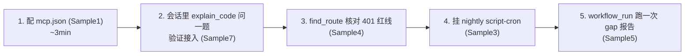

| 步骤 | 命令/动作 | 预期产出 |
|------|-----------|----------|
| 1 | 写 `mcp.json`（Sample 1） | Kiro 出现 codelens 21 工具 |
| 2 | 「用 codelens 解释离岸风质加成」 | 带引用的答案（例 2） |
| 3 | `find_route` | 所有路由 + 鉴权核对表 |
| 4 | `cron_add` nightly（Sample 3） | 每晚自动刷新 spec |
| 5 | `workflow_run`（Sample 5） | 中文 gap 整合报告 |

## A.5 ROI 直觉

- **一次性成本**：配置 ~10 分钟；CodeLens 已部署（无新增基建）。
- **边际成本**：增量重生成只算 commit-diff 符号的 Bedrock token（分钟级、几美分），AOSS 固定成本与是否结合无关。
- **回报**：一次拦截线上 500（如 float→Decimal）即可覆盖数月运行成本；日常"问代码/查影响/守红线"从分钟级人工降到秒级自动。

---

# 附录 B — 实操配置步骤教程（MeshClaw 落地）

> 本附录给出在 MeshClaw 上落地本整合的**完整配置文件清单 + 分步教程**。
> ⚠️ **安全铁律**：真实 Bearer 令牌只写进**仓库外**的本地文件（`~/.kiro/...`、`~/.meshclaw/secrets/...`）；本仓库为 public，文档内一律用 `<CODELENS_TOKEN>` 占位符。

## B.1 配置文件清单（谁在哪、含不含 token）

| 文件 | 位置 | 作用 | 含 token? | 入库? |
|------|------|------|:--------:|:-----:|
| `mcp.json` | `~/.kiro/settings/mcp.json`（全局） | 把 CodeLens 21 工具挂进 Kiro/MeshClaw 会话 | ✅ | ❌ 仓库外 |
| `codelens.env` | `~/.meshclaw/secrets/codelens.env` | cron 脚本读取的令牌 | ✅ | ❌ 仓库外 |
| `codelens_gen.py` | `~/.meshclaw/crons/codelens_gen.py` | nightly 增量重生成脚本（零 token 运行） | ❌（运行时读 env） | 可（无密钥） |
| 本文档 | `docs/codelens-meshclaw-integration.md` | 方案与教程 | ❌ 占位符 | ✅ public |

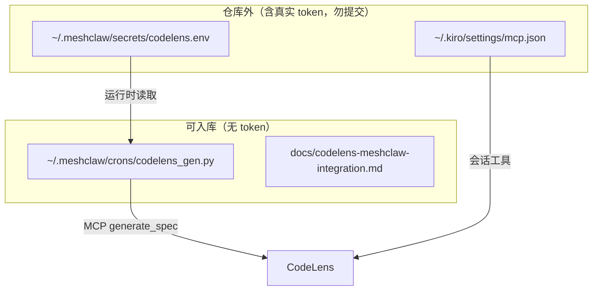

## B.2 分步教程

### 步骤 1 — 全局 mcp.json 挂载 CodeLens（会话工具）
编辑 `~/.kiro/settings/mcp.json`，在 `mcpServers` 下**新增**（不要覆盖已有 server）：
```jsonc
"codelens": {
  "url": "https://d1t9q5qxrql3xj.cloudfront.net/mcp/",
  "headers": { "Authorization": "Bearer <CODELENS_TOKEN>" },
  "disabled": false,
  "autoApprove": ["get_specification_doc","explain_code","find_symbol","find_callers",
                  "find_callees","get_impact","find_route","build_context",
                  "find_affected_tests","search_spec_artifacts","get_all_packages",
                  "get_package_metadata","find_spec_revisions","get_revision_metadata"]
}
```
Kiro 里 reconnect MCP（或重启）→ 出现 codelens 工具。**验证**：会话里说「用 codelens explain_code 解释离岸风质加成」。

### 步骤 2 — 令牌落到仓库外 secrets
```bash
mkdir -p ~/.meshclaw/secrets
cat > ~/.meshclaw/secrets/codelens.env <<'EOF'
CODELENS_MCP_URL=https://d1t9q5qxrql3xj.cloudfront.net/mcp/
CODELENS_TOKEN=<CODELENS_TOKEN>
EOF
chmod 600 ~/.meshclaw/secrets/codelens.env
```

### 步骤 3 — 放置 nightly 增量重生成脚本
脚本已提供于 `~/.meshclaw/crons/codelens_gen.py`（读 env token → `generate_spec` → 轮询终态 → `ctx.notify`）。核心逻辑见附录 A Sample 3；完整版落在该路径。

**dry-run 验证**（不投递通知）：
```bash
meshclaw cron preview ~/.meshclaw/crons/codelens_gen.py:run \
  -m '{"name":"liangyimingcom/surf-forecast","branch":"master"}'
```

### 步骤 4 — 注册 nightly cron（零 token）
在 MeshClaw 会话中调用（或用等价 CLI）：
```
cron_add(
  name="codelens-nightly-surf-forecast",
  cron_expr="0 3 * * *",           # 每天 03:00
  timezone="Asia/Shanghai",         # GMT+8
  script="~/.meshclaw/crons/codelens_gen.py:run",
  message='{"name":"liangyimingcom/surf-forecast","branch":"master"}',
  hide_in_chat=true)                # fire-and-forget，不占 Chats 侧栏
```
> 因 CodeLens 按 commit-diff 渐进复用，无变更时 nightly 秒级返回、成本极低。

### 步骤 5 — 用 workflow 实跑一次 gap 报告
```
workflow_run(intent="对 liangyimingcom/surf-forecast 用 CodeLens 生成的 spec 做 gap 分析：
抓 specification.md/system-overview.md，与本地 .kiro/specs/* 及 steering 红线逐条核对，
用 find_route/get_impact/search_spec_artifacts 复核五条红线，产出中文整合报告。")
```
返回 `run_id` → Workflows 面板看进度 → 完成后报告自动回灌会话。

## B.3 运维速查

```
cron_list                                  # 查看所有任务（找 codelens-nightly-surf-forecast）
cron_trigger(job_id="<id>")                # 立即手动跑一次
cron_pause(job_id="<id>") / cron_resume    # 暂停 / 恢复
cron_update(job_id="<id>", cron_expr="0 */6 * * *")   # 改成每 6 小时
```
- 改分析对象：改 cron 的 `message` JSON 里的 `name`/`branch`。
- 换令牌（轮换后）：只改 `~/.meshclaw/secrets/codelens.env` 与 `mcp.json`，脚本无需动。

## B.4 落地状态（本项目已完成）

| 项 | 状态 |
|----|------|
| `~/.kiro/settings/mcp.json` 挂载 codelens | ✅ 已合并（enabled） |
| `~/.meshclaw/secrets/codelens.env` | ✅ 已写入真实令牌 |
| `~/.meshclaw/crons/codelens_gen.py` | ✅ 已放置并 dry-run 连通 |
| nightly cron `codelens-nightly-surf-forecast` | ✅ 已注册（03:00 Asia/Shanghai） |
| gap 报告 workflow | ✅ 已启动（后台运行） |
