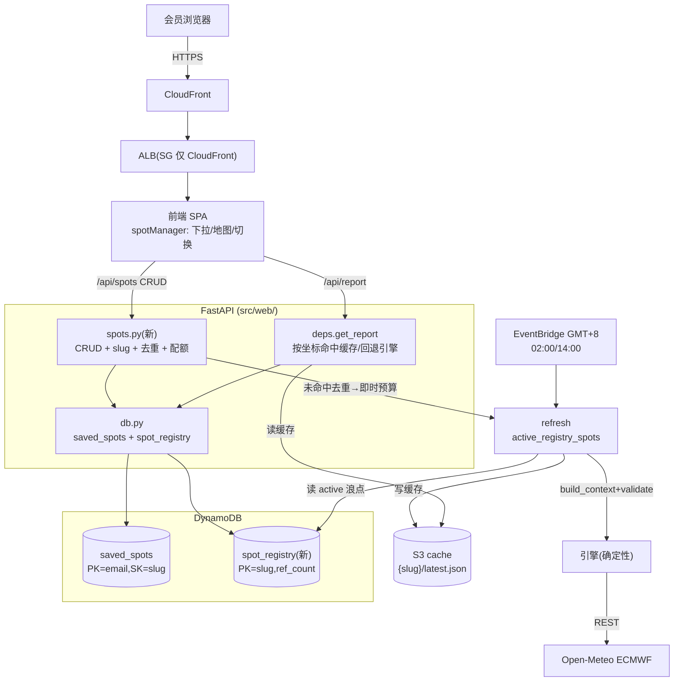
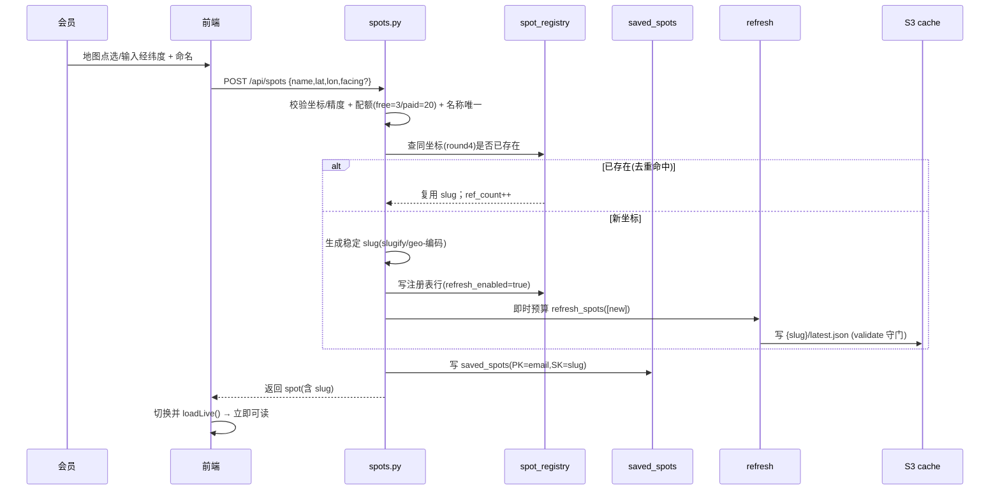
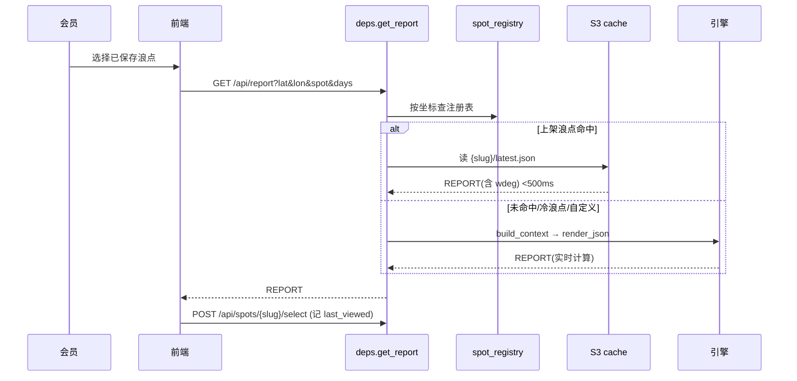
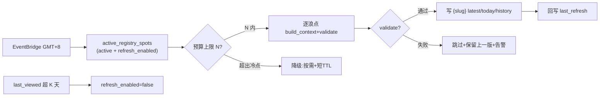

# Custom Spots — 架构/流程图 + 工作量与排期评估

> 配套 [.kiro/specs/custom-spots/](../.kiro/specs/custom-spots/) 三件套。仅文档，不改源码。
> 区域 ap-northeast-1 ｜ 把 `refresh.py::DEFAULT_SPOTS` 硬编码升级为 DynamoDB 动态浪点注册表。

## 1. 架构图（组件与数据流）

## 2. 流程图：新建自定义浪点（即时预算）

## 3. 流程图：浪点切换查询（读侧）

## 4. 流程图：每日动态刷新（写侧，注册表驱动）

## 5. 实现工作量评估

> 颗粒度：人日（1 人日 ≈ 熟悉本仓的工程师专注 1 天）。含编码 + 单测，不含跨团队评审等待。

| 阶段 | 任务 | 工作量 | 风险 |
|------|------|--------|------|
| **1 数据层** | db 访问方法 + spot_registry 模型 + slug/去重/区域推断 + moto 测试 | **2.0** | 🟢 纯代码，moto 离线 |
| **2 CRUD API** | spots.py 5 路由 + 校验转义 + 配额 + 软删 + 测试 | **2.5** | 🟡 边界多(唯一性/配额/转义) |
| **3 查询切换** | deps.get_report 扩展按坐标命中 + select 记忆 + 契约测试 | **1.0** | 🟢 复用现有缓存读 |
| **4 动态刷新** | active_registry_spots + 即时预算 + 频率控制 + 冷点回收 + 测试 | **2.5** | 🟡 去重/预算上限/竞态 |
| **5 前端** | spotManager 下拉/新增面板/切换/管理(附加式) + JS 校验 + 浏览器走查 | **2.5** | 🟡 不破坏现有 MVP；地图(5.5)阶段B另计 |
| **5.5 地图(阶段B)** | 开源底图点选回填(可选增强) | **1.5** | 🟢 可延后 |
| **6 IaC** | storage 加 spot_registry 表 + IAM + validate/plan | **1.0** | 🟡 apply 需审批；表 replace 竞态教训 |
| **联调+E2E+修复** | 端到端(创建→刷新→切换→缓存命中) + 部署冒烟 | **1.5** | 🟡 |
| | **MVP 合计（不含地图）** | **≈ 13 人日** | |
| | **含地图阶段B** | **≈ 14.5 人日** | |

## 6. 排期（建议，单人推进）

```mermaid
gantt
  title custom-spots 实现排期(单人,人日)
  dateFormat X
  axisFormat %s
  section 后端
  阶段1 数据层+注册表      :a1, 0, 2d
  阶段2 CRUD API          :a2, after a1, 3d
  阶段3 查询切换          :a3, after a2, 1d
  阶段4 动态刷新编排      :a4, after a3, 3d
  section 前端
  阶段5 spotManager       :b1, after a3, 3d
  section 上线
  阶段6 IaC(apply审批)    :c1, after a4, 1d
  联调E2E+修复            :c2, after c1, 2d
  section 可选
  阶段5.5 地图(阶段B)     :d1, after c2, 2d
```

**关键路径**：1 → 2 → 4 → 6 → E2E（后端约 11.5 人日）；前端 5 可与 4 并行。**MVP 可上线约 2.5-3 周**（单人，含审批等待缓冲）。

## 7. 风险与前置

| 风险 | 缓解 |
|------|------|
| DynamoDB 同名表 replace 竞态（历史教训） | 新表 create_before_destroy 或确认删除完成再 apply |
| 坐标枚举滥用 Open-Meteo | 全局去重 + 每用户每日新建上限 + 预算上限 N |
| 前端改动破坏现有 MVP | 附加式扩展(const→可切换 SPOT)，失败回退内嵌不白屏 |
| apply 审批门 | 阶段 6 plan 摘要后人工授权(遵守 apply 红线) |

## 8. 不变量（继承红线）
slug 不可变作缓存键；validate 守门；读写解耦；GMT+8 日界；离岸判定按该点 spot_facing_deg；未标定海域标注"按黄海近似"；鉴权全后端 401 保护。
