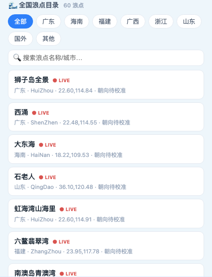
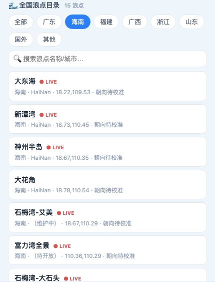
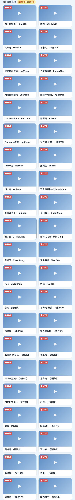
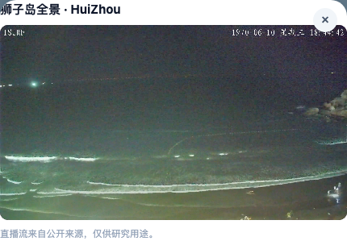

# 形态C整合 · 功能介绍（石老人 × surf-forecast 统一后端）

> 以石老人「实时浪报」产品形态为主题（全国 58+ 浪点 + 真实摄像头直播 + 实时列表），surf-forecast 引擎能力为辅（评分/离岸风质/双周期/昨日回看）。
> 统一后端 FastAPI；**预报一律 surf-forecast 引擎自算**（Open-Meteo），直播前端 hls.js 直连上游。全程 GMT+8；引擎内核零改动；pytest 118→126。
> 方案详版：`docs/石老人整合方案-formC.md`。

## 一、全国浪点目录（58+）
- 石老人 `getCamera` 全量 58 浪点导入 surf-forecast 注册表（`tools/import_shilaoren_spots.py` + `src/web/seed.py`），坐标来自 `getNewForecast`，写入过 `float→Decimal`。
- 前端「🌊 全国浪点目录」：**区域筛选**（广东22/海南15/福建5/山东3/广西3/浙江2/国外7/其他1）+ 名称/城市搜索 + 评分徽标（缓存回批/点击回填，色阶 绿≥7/黄≥5/橙≥3/红）。
- 点击浪点 → 引擎自算浪报（`/api/report`），含 wdeg/双周期/离岸风质/物理叙事。
- 后端：`GET /api/catalog`（401，含 region/has_live）、`GET /api/catalog/scores`（缓存回批）。

## 二、真实摄像头直播
- `GET /api/cams`（401，从注册表返回含 `live_src` 的浪点，42 个）。
- 前端 `hls.js`（Safari 原生 HLS）**直连上游** `isurfvideo.c-pan.cn`（CORS 任意源，不经后端代理）。
- 「📹 浪点直播」网格 + 点击播放弹层；详情页有直播的浪点显示「📹 本浪点有实时直播」入口横幅。

 

## 三、引擎增强（surf-forecast 辅）
- 详情浪报主体 = surf-forecast 引擎渲染：综合评分、离岸风质（offshore/cross/onshore）、双周期 Tm/Tp、物理叙事、最佳窗口、板型建议。
- **昨日回看校验**：对任一浪点可用（引擎历史模式，`/api/report/history`），date 为 GMT+8 昨日、含 predict、与预报区日期互斥。

## 四、合规
- 石老人逆向部分（浪点坐标/直播 live_src）**仅研究用途**；直播接口 401 门禁（登录可见，非完全公开）。
- 社区（活动墙/拼车/公告/关于/反馈）沿用示例 sample，不复刻登录态/支付/社区写入。
- 浪点朝向 facing 按区域粗估、标「待校准」（离岸风质依赖，后续可逐点校准）。

## 五、数据真实性标注
| 数据 | 来源 |
|------|------|
| 浪点坐标/名称/直播源 | 石老人上游导入（研究用途） |
| 预报/评分/离岸风/双周期/昨日回看 | **surf-forecast 引擎自算**（Open-Meteo ECMWF） |
| 社区/公告/关于/周边 | 前端示例 sample |
