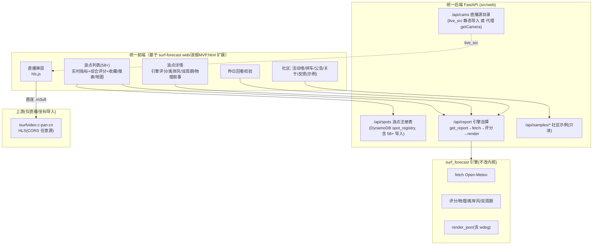
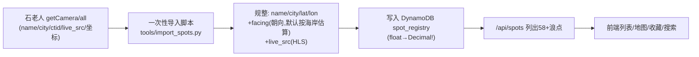
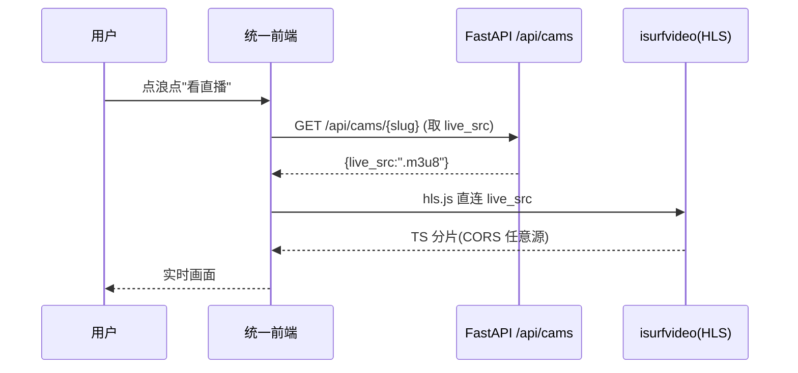
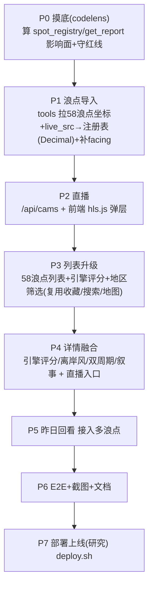

# 石老人 × surf-forecast 整合方案（形态 C · 统一后端）

> **主题**：以「石老人实时浪报」的产品形态为主题（全国 58+ 浪点 + 真实摄像头直播 + 实时列表 + 社区）；
> **辅**：以 surf-forecast 的深度评分引擎、离岸风质、双周期、昨日回看校验为增强能力。
> **形态 C**：引擎下沉，**统一到 surf-forecast 的 FastAPI 后端**——石老人的多浪点/直播接入并进来，**预报一律由 surf-forecast 引擎自算（Open-Meteo）为准**。
> **交付**：最终合并成一个可运行应用，**并入 surf-forecast** 仓库。
> **用途**：研究目的；直播作为核心保留并（在自有基础设施上）上线。
> **本文件仅为方案，不含代码实现。**

---

## 一、已确认决策（来自用户）

| 项 | 决策 |
|----|------|
| 融合形态 | **C：引擎下沉，统一 surf-forecast FastAPI 后端** |
| 浪点覆盖 | 全国 **58+ 浪点**（来自石老人 `getCamera`） |
| 预报数据 | **以 surf-forecast 引擎自算为准**（Open-Meteo ECMWF），弃用石老人 `getNewForecast` 预报值 |
| 直播 | **真实摄像头直播作为核心保留**（HLS，源自石老人上游 `isurfvideo.c-pan.cn`） |
| 交付物 | **可运行应用**（非仅文档） |
| 落位 | **并入 surf-forecast** |
| 上线 | 研究目的、自有基础设施 |

---

## 二、目标架构（形态 C）

**核心原则**：预报统一走引擎；直播视频前端直连上游（CORS 任意源，不经后端代理）；石老人上游仅用于**一次性导入浪点坐标 + live_src**，不作预报数据源。

---

## 三、浪点注册表整合（58+ 浪点）

- 坐标来自石老人 `getNewForecast/{cId}` 的 `latitude/longitude`（逐点拉一次，缓存）。
- **facing（浪点朝向）**：石老人无此字段，而离岸风质算法依赖它——需**逐浪点补充朝向**（按海岸线方位估算或人工标注，默认给保守值并标注"朝向待校准"）。⚠️ 这是形态 C 的关键工程点。
- 写入 DynamoDB 必过 `float→Decimal`（红线）。

---

## 四、直播整合

- `live_src` 随注册表导入静态存储（或后端按需代理石老人 `getCamera` 刷新）。建议**静态导入**减少对上游运行时依赖。
- 视频流 CORS 反射任意 Origin，`hls.js` 前端直连，**不经后端代理**（省带宽、避合规代理争议）。
- Safari 走原生 HLS，其余用 hls.js（`lowLatencyMode`）。

---

## 五、预报统一（引擎自算为准）

| 石老人字段 | 整合后来源 | 说明 |
|-----------|-----------|------|
| `tableData` 16天预报 | ❌ 弃用 | 改由引擎 `get_report` 自算 |
| 浪高/周期/风 实时指标 | ✅ 引擎首日值 | 列表卡片指标用引擎输出 |
| `sun` 日出日落 | 引擎/计算 | GMT+8 |
| 评价星级 | ✅ 引擎评分重算 | 加权模型 + 离岸风质 |
| `latitude/longitude` | ✅ 导入注册表 | 喂引擎 |
| `live_src` | ✅ 导入 cams | 直播 |

- 所有浪点预报统一 DATA CONTRACT（含 `wdeg`、双周期 Tm/Tp、图表数字字段），前端复用现有 SVG 图表 + 评分叙事。

---

## 六、社区功能（沿用 surf-forecast 已实现的 R2 示例）

活动墙/拼车/公告/关于/反馈——**沿用当前 surf-forecast 前端已落地的示例 sample 版**（已上线），不接石老人真实社区上游（合规：不复刻登录/发布/隐私写入）。

---

## 七、分阶段实施路线（形态 C）

- 每阶段守 surf-forecast 红线，先 codelens 摸底/算影响面。
- 引擎内核（physics/scoring/validate）不改；新增均在 web 层 + 注册表导入 + `/api/cams`。

---

## 八、关键工程点与风险

| # | 事项 | 风险/对策 |
|---|------|----------|
| 1 | **浪点朝向 facing** | 石老人无此字段，离岸风质依赖它 → 需逐点估算/标注，默认标"待校准" |
| 2 | **58 浪点引擎负载** | 每点实时 Open-Meteo + 评分 → 沿用缓存(每日刷新)，列表用缓存首日值，避免 58×实时 |
| 3 | **坐标一次性拉取** | 依赖石老人 `getNewForecast` 拉坐标(逐点) → 一次性导入后不再依赖 |
| 4 | **直播源时效** | live_src 可能变更 → 提供刷新脚本；失效则降级占位 |
| 5 | **DATA CONTRACT** | 58 浪点全部须含 wdeg/数字字段，否则前端 SVG NaN |
| 6 | **float→Decimal** | 导入注册表写 DynamoDB 必转 Decimal（红线，moto 不暴露） |

---

## 九、合规声明（重要）

- 石老人「实时浪报 / ISURF」为**第三方商业微信小程序**；本整合体对其**逆向**部分（浪点坐标、直播 `live_src`、上游接口）**仅用于学习研究**。
- 用户已明确：直播作为核心保留、在自有基础设施上以**研究目的**上线。⚠️ 提示：公开托管第三方直播流/坐标存在**版权与服务条款风险**，建议：
  - 访问控制（会员/口令门禁，非完全公开）；
  - 显著标注数据来源与"研究用途"免责；
  - 不复刻登录态/支付/社区写入；社区用示例数据。
- surf-forecast 自有部分（引擎/评分/Open-Meteo 数据）无此风险。

---

## 十、与当前 surf-forecast 的差异摘要（改动面）

| 层 | 形态 C 新增/改动 | 是否碰红线区 |
|----|----------------|-------------|
| 注册表 | 导入 58+ 浪点(+live_src+facing) | DynamoDB 写(Decimal) |
| 后端 | 新增 `/api/cams` 直播目录(只读) | 新路由须鉴权策略明确 |
| 引擎 | **不改内核** | 否 |
| 前端 | 列表扩为多浪点+地区筛选+直播弹层(hls.js) | 附加式 |
| 社区 | 沿用现有 R2 示例 | 否 |
| 部署 | deploy.sh 沿用；前端内置镜像 | 纯 web + 注册表数据 |

---

## 十一、待细化确认（进入实现前）

1. **直播访问控制**：完全公开 vs 会员/口令后可见？（合规建议后者） = 完全公开
2. **浪点朝向**：接受"默认估算+标注待校准"，还是要逐点人工标注 58 个朝向？=接受"默认估算+标注待校准"
3. **地区筛选**：是否按石老人的 广东/海南/福建/广西/浙江/山东/其他/国外 分类？=是
4. **58 浪点缓存刷新**：是否把这 58 点全部纳入每日 EventBridge 定时刷新（成本上升）？=是
