# 移植功能 · 功能介绍（surf-forecast × 石老人复刻）

> 本文介绍从「石老人实时浪报」复刻验收成果移植/新增到 surf-forecast 前端（`web/浪报MVP.html`）的 11 项功能。
> **数据策略**：地图/收藏/搜索/排序作用于**真实浪点**（`/api/spots` + 引擎坐标）；社区/公告/关于/周边/直播为**示例 sample**（surf-forecast 无对应上游，均标注「示例数据」，不引外部第三方 API）。
> 全程 GMT+8；附加式实现，不触碰引擎内核与既有 MVP 渲染，pytest 118 基线零倒退。

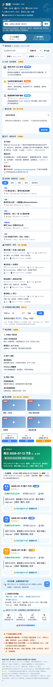

## 一、真实浪点增强（R1）

| # | 功能 | 说明 | 数据 |
|---|------|------|------|
| R1.1 | ⭐ 浪点收藏 | 卡片 ★ 星标，localStorage 持久化，收藏自动置顶，刷新保留 | 真实 `/api/spots` |
| R1.2 | 🔍 搜索 + 排序 | 名称搜索 + 排序（收藏优先 / 名称 A→Z / 纬度北→南），空态提示 | 真实 |
| R1.3 | 🗺️ Leaflet 浪点地图 | 「🗺️ 地图」开关；按真实 lat/lon 打点，`fitBounds` 聚焦，popup「查看浪报」→切换该浪点并加载浪报 | 真实 |

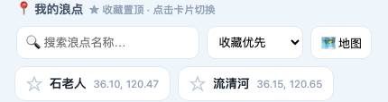
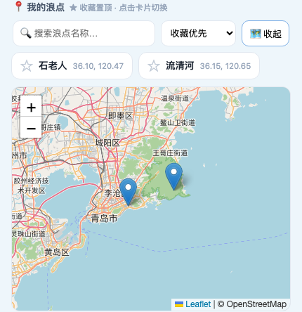

- **为什么**：把「我的浪点」从下拉升级为可收藏、可搜索、可视化地图选点，多浪点管理体验对齐石老人复刻版，且全部作用于 surf-forecast 真实浪点数据，零伪造。
- **复用**：直接复用前端已加载的 `leaflet@1.9.4`，零新依赖；独立 `#spotsMap` 容器，与创建浪点用的 `#miniMap` 分离。

## 二、社区 / 工具（R2，示例 sample）

| # | 功能 | 说明 |
|---|------|------|
| R2.1 | 📢 公告详情 | 公告列表 → 点击打开富文本弹层（h3/h4/p/ul/strong），Esc/背景关闭 |
| R2.2 | 💬 意见反馈 | 7 类枚举 + 内容框，前端校验（缺类型/内容报错）→ 成功占位（演示不写库） |
| R2.3 | ℹ️ 关于·商务合作 | 关于我们 / 商务合作 / 联系方式三段脱敏示例（占位邮箱） |
| R2.4 | 📰 活动墙 | 5 条示例活动 + 类型 chips 筛选 + 富文本详情弹层 |
| R2.5 | 🚗 冲浪搭子/拼车 | 4 条示例只读（出发→到达/日期/余座/费用/备注/发布者），微信**脱敏** |

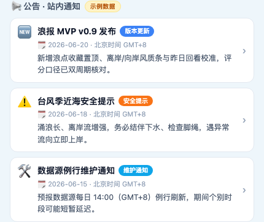 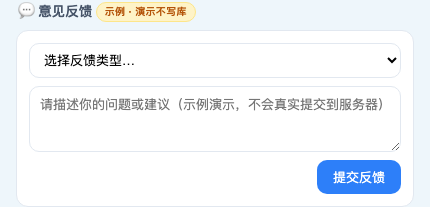
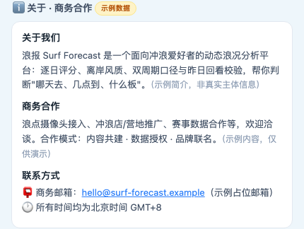
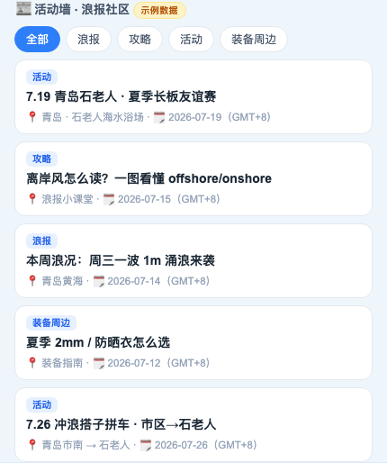 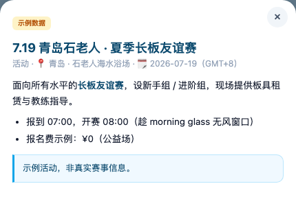
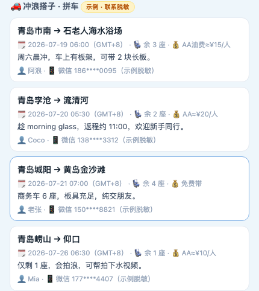

## 三、石老人补充模块（A / D / F）

| # | 模块 | 功能 | 说明 |
|---|------|------|------|
| R2.6 | F | 🏄 排水量计算器 | 石老人**同款公式**：排水量 = 体重 × 水平系数（6 档）；标定 70kg 中级 = 31.0L、初学者 = 49.0L |
| R2.7 | D | 📍 周边推荐 | 示例商户按类型分组（冲浪店/俱乐部 · 餐厅酒吧 · 酒店民宿） |
| R2.8 | A | 📹 在线视频直播占位 | 4 个浪点摄像头**占位卡**（无真实 HLS 流，点击明确提示演示） |

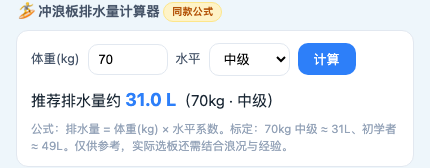
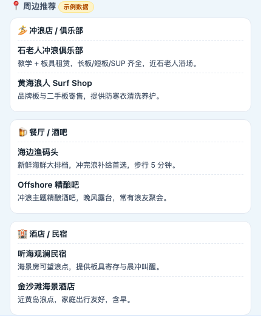 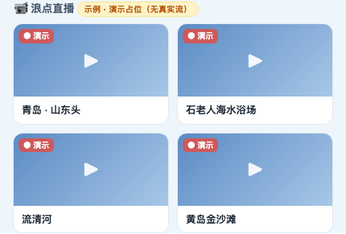

## 四、合规与红线

- 仅公开只读 / 前端示例；**不做登录态、支付、社区发布/编辑/二手交易**。
- 社区/公告/周边/直播全为**前端内置示例常量**，明确「示例数据」标注，不引外部第三方内容 API。
- 联系方式脱敏（微信 `186****0095`）；直播占位不误导为真实流。
- 全程 GMT+8；不改引擎内核；`/api/spots` 仍全 401；DATA CONTRACT（wdeg）未受影响；pytest 118 零倒退。
